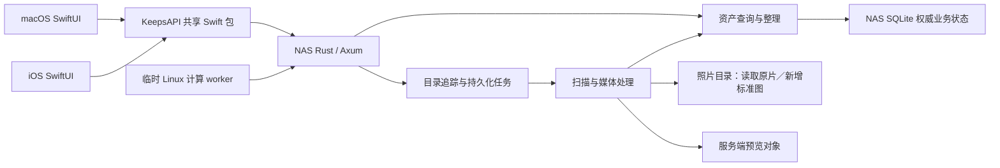

# Keeps 架构

产品导航与能力边界见 [统一服务端资料库](UX_DESIGN.md)。统一采用 HTTP/HTTPS API；macOS 支持显式文件夹导入，逻辑相册尚未实现。

## 唯一运行模式

Keeps 采用一个 NAS 核心服务和两个原生薄客户端。NAS 是照片索引、整理结果、任务状态和预览对象的唯一真源；macOS 与 iOS 只负责用户交互、HTTP 请求及可丢弃的列表与图片缓存。

客户端使用共享 HTTP API。`chuan_nas` 的正式图库已从 Docker 迁至原生 SPK，原片路径保持不变，数据库与预览使用独立状态副本；旧 Docker 停止并保留。当前使用局域网入口，部署与验证见[原生迁移记录](validation/2026-10-05-spk-production-migration.md)。



## 代码入口与职责

| 目录 | 职责 |
| --- | --- |
| `server/` | 唯一活跃后端：Rust HTTP API、权威查询模型、SQLite、任务和媒体处理。 |
| `shared/` | `KeepsAPI` Swift 包：HTTP 请求、DTO、连接偏好及 Keychain 凭据；无 SQL、事件回放或照片处理。 |
| `macos/` | 统一资料库浏览、选择、筛选、整理表单及服务器来源/任务界面；`LibraryStore` 仅保存 UI 内存状态。 |
| `ios/` | 原生图库、详情与整理交互；`IOSLibraryStore` 通过同一个 `KeepsClient` 查询 NAS。 |
| `deploy/nas/` | Docker 构建、历史部署与回退参考。 |
| `deploy/spk/` | 当前原生套件打包、启动与配置。 |
| `control_plane/` | 旧 Python 协议、迁移 seed 工具与对照测试；不是第二套活跃后端。 |
| `scripts/` | 客户端打包入口和显式执行的迁移工具。 |

Rust 主要模块：

- `main.rs`：配置、状态装配、监听与停机。
- `api.rs`：HTTP 认证和路由。
- `catalog.rs`：资产查询及数据库事务内的直接修改。
- `jobs.rs`：目录追踪、持久化扫描任务与文件处理记录。
- `media.rs`：原片元数据读取、精确 JPEG 图像指纹与预览生成。
- `versions.rs`：照片版本证据、候选查询及稳定默认版本。
- `revisions.rs`：持久化资料库／目录修订树、SQL 变更捕获和事务内祖先传播。
- `watcher.rs`：文件系统监听、目录变化入队和监听补漏。
- `store.rs`：数据库连接、业务表初始化和迁移；运行时不维护 ledger 或多源事件协议。
- `previews.rs`：服务端预览对象及签名 URL。

后台任务的启动、轮询和恢复属于 NAS 进程。客户端关闭、离线或更换设备不得决定任务生命周期。

## 客户端边界

macOS 使用标准 Settings scene（⌘,）配置 Keeps Server 的服务地址、资料库和访问令牌；先验证服务鉴权与资产查询，成功后才持久化并切换连接。设置的“来源”页管理服务器目录追踪和手动扫描；独立的“任务追踪”原生窗口显示扫描进度和失败重试，每 5 秒自动更新，关闭使用系统窗口按钮；滚动条采用自动隐藏的浮动样式。设置不管理 NAS 设备、SMB 挂载或 SSH 登录。

两端的查询与修改经过 `shared/Sources/KeepsAPI/KeepsClient.swift`。客户端不创建业务 SQLite，不生成、上传或回放 ledger，不进行本地资料库扫描、不解析 EXIF，也不从本地原片生成预览。macOS 仅在用户显式导入时递归枚举所选文件夹、计算传输校验哈希并上传文件。

客户端不存在“NAS / 本地”双资料库模式。默认浏览统一资料库；服务器来源目录属于按需展开的辅助视图和服务端管理配置。主图库查询不依赖目录导航成功。客户端无需 SMB 挂载，不能把服务器路径作为本机文件 URL 打开；预览和业务交互均走 HTTP。

本地文件仅作为显式上传来源，不恢复客户端监听、资料库扫描或本地业务数据库。协议选择保持 HTTP JSON，当前共用手写 KeepsAPI；尚未引入 OpenAPI 客户端生成器。
客户端允许保留：

- 当前筛选、选择、已加载分页、按查询保存的列表内存缓存及表单状态。
- 服务地址与资料库名称等 UserDefaults 偏好。
- Keychain 中的访问凭据；旧 `ios.sync.*` 偏好继续读取，明文凭据成功迁移后移除。
- 网络图片缓存。缓存不是业务真源，丢失后可重新请求 NAS。

界面上的“修改评分”“保存标签”“移入回收站”直接提交资产 API，并使用服务器返回结果。请求失败显示错误，不切换到本地写入模式，也不排队产生离线业务事件。

两端共享 `KeepsAssetCache` 保存已加载的列表与分页游标，每个连接独立持有；身份包括目录、筛选、搜索、排序、隐藏开关与页大小，不把续页 cursor 当成不同查询。缓存仅在内存中，最多保留 20 个查询、合计 10,000 个资产条目，按最近使用淘汰；切换服务器、资料库或凭据时清空。它不承担业务持久化，退出应用后重新读取服务器。

Mac 返回已访问范围时先显示缓存，再使用该目录的 `/revision?path=...` 验证；全库查询核对库版本。iOS 返回已访问范围只恢复缓存，只有滚动到底部继续向上拉并松手才校验版本、按需刷新。只有列表快照和最新状态均 `isUpdating=false` 且 revision 相同才能复用稳定缓存。列表使用自身响应的版本，不能用先前单独请求的版本覆盖。跨页版本不同或任一页修改中不能组成稳定快照；版本跨越时重新同步已加载范围，避免混合游标结果。缓存失效或主动刷新期间保留已有照片，失败保留内容并显示错误；首次无缓存才显示空白加载状态。

Mac 前台每 5 秒核对当前范围，连续同一修改窗口的自动列表重载最多每 30 秒一次，最终版本变化及时刷新。iOS 无自动轮询、回前台刷新、定时目录刷新、刷新按钮或下拉刷新；图库及目录列表统一由底部继续上拉约 60pt 并松手触发，空列表也可执行。首次访问未缓存范围及加载更早照片仍按需请求；修改照片只应用服务器返回值并标记缓存待校验，不自动重拉列表。iOS 续页发现版本变化时，在同一互斥加载中自动重读已浏览范围与下一页，完成前保留已有内容，成功后更新底部新照片并保留当前可见照片所在行，不要求回到底部。重读期间若版本再次变化，合并结果标记为非稳定缓存，不循环重启加载；请求失败保留原列表和真实错误。Mac 维持主动刷新及修改后即时同步。

API 请求绕过 URLCache，版本判断由上述协议负责。目录导航来自真实文件系统，不能仅依赖 catalog 版本；Mac 保留 5 分钟更新及显式刷新，iOS 只在首次访问或底部上拉时查询。Mac 全库计数独立采用 60 秒更新窗口，主动刷新及本端修改后立即更新，不把目录修订号当作全库计数版本。

图片分为小缩略图、标准照片和可选 RAW。网格使用 `thumbnail`（迁移期间可显示旧 `preview`），查看器先小图再加载 `standard`。标准照片直接复用同资产已确认的 JPEG/HEIF，仅缺少已确认标准图的 RAW 由 NAS 生成完整分辨率 HEIF，保留指定拍摄元数据；生成的标准照片放在 RAW 所在的 `/volume2/photo` 对应目录，文件名使用 RAW 同名主干和 `.heic` 扩展名，重名时递增 `.1.heic`、`.2.heic`，不在名称中加入哈希；元数据 `Software` 和 `XMP CreatorTool` 标记为 `Keeps`，登记为同一资产的文件版本，不属于可删除缓存。仅创建新文件，不覆盖已有照片；3FR 暂缓标准图生成，仍生成小图。视频只向图片客户端提供封面，`standard` 为 null，不把整段视频交给图片解码器。

两端共享 `PreviewCache`，目录为系统 Caches/KeepsMediaV2 下的 thumbnail、standard、preview。小图不设固定总容量上限，可全库保存；标准照片与过渡旧预览分别为 5 GiB LRU，超限回收至 4 GiB。空闲空间低于 1 GiB 时回收当前用途的缓存；小图预取要求超过 2 GiB 空闲空间。升级只清理一次旧专用 KeepsPreviews，标记持久化；系统仍可回收 Caches，因此不承诺永久离线保存。内存成本按解码后的 bytesPerRow × height 计算，三个用途合计 iOS 64 MiB、macOS 256 MiB，按显示尺寸和屏幕倍率下采样。

缓存身份由服务器 URL、资料库、资产 UUID、用途和内容版本组成，不含签名 URL；相同用途身份的并发下载合并，不额外使用 URLCache。链接有效期 15 分钟；仅对 `preview_token_expired` 自动按用途刷新并重试一次，缓存登记实际返回版本。前台 `ThumbnailPrefetch` 以持久分页游标逐张预取小图，覆盖隐藏与回收站资产；为交互下载让路，不修改可见列表或其刷新规则，退出前台可暂停，下次运行继续。iOS 同时注册 `BGProcessingTask`，需要网络连接，在系统安排的后台时段复用同一预取器与分页断点；一轮覆盖普通资产和回收站后结束，系统到期则取消，后续运行继续。后台运行时机由 iOS 决定，不保证锁屏后立即下载或一次完成全库。

NAS schema 6 增加照片、视频、目录实体表；旧 catalog 保留公共资产查询、版本和整理状态，实体表随其同步，空目录在扫描时入库。`media_cache` 保存源版本、生成规格、pending/processing/ready/failed 状态、有限重试和实际对象；扫描只入库，现有单 worker 统一处理历史、新增和失效缓存。NAS 本地每轮最多 20 个，轮后休息 60 秒，并发 1；临时 Linux worker 有独立的并发与资源上限，共享同一任务状态，不能重复领取 processing 项。缩略图最长边 512px，`KEEPS_THUMBNAIL_QUALITY` 默认 50，纳入规格版本；源变化、丢失、标准文件时间戳变化会重新排队。审计有独立时间字段，不伪造最近成功进度。完整尺寸标准照片编码 watchdog 为 900 秒，缩略图/旧预览仍为 180 秒；内存和线程限制相同。

schema 8 增加 `remote_cache_tasks`，保存 Linux worker 的领取凭证、输入版本、1800 秒租约及完成状态。Linux 通过鉴权 HTTP 主动领取、下载、续租和上传；NAS 校验后沿用标准图独占发布与缓存登记。完成凭证和缓存 ready 在同一事务提交；断线可重试完成，租约过期回收且最多尝试 4 次。Linux 不直接访问数据库、不挂载照片目录、不对外监听。

schema 9 增加照片根身份映射。优先读取内嵌 XMP `xmpMM:OriginalDocumentID`，其次同目录 XMP；合法非空 UUID 直接信任，不要求内容哈希证明。缺少时沿用已有资产 UUID，新资产生成 UUID，并补写 metadata。ExifTool 支持写入的格式直接内嵌；3FR 等不支持格式写入 `原文件名.扩展名.xmp`，不改变 RAW 数据。同根 ID 的不同内容保留为版本/位置，移动后更新路径并保留资产 ID。生成标准图在 NAS 发布前继承根 ID。数据库仍是评分、标签、路径及任务的真源。

历史文件身份回填由 NAS 现有后台执行，每轮最多 20 个，沿用至少 60 秒休息；路径同步优先，正在远端处理的资产跳过。仅 metadata 写入造成的字节哈希变化在现有数据库事务中更新文件、版本、默认图、已完成远端任务及缓存描述，保留缩略图。`cache-status.identityBackfill` 提供 pending/ready/failed/missing 和错误；missing 代表历史路径已不存在，不删除任何照片。合法 ID 已存在时不重写。

临时 worker 在数据库事务中从现有状态索引直接领取一个到期 pending 项（LIMIT 1），不做全库优先排序，也不另设内存任务队列。缺标准的 RAW 仍在同一个任务中先生成完整标准图再生成小图，尚未拆为两个独立阶段。默认 4 并发、8 CPU、12GiB RAM、32GiB 临时预算。日常默认 NAS 本地编码开启（KEEPS_LOCAL_CACHE_ENCODING_ENABLED=1），远端派发关闭（KEEPS_REMOTE_WORKER_ENABLED 未设或为 0）。Linux 只在用户明确安排的一次性大规模处理时启用；服务器开关设为 1 后才能领取任务，Compose 需要显式 bulk profile，且不自动重启。批量处理结束恢复远端开关为 0 并停止 worker。部署见 [Linux worker](../deploy/linux-worker/README.md)。

`KEEPS_CACHE_GC_ENABLED=1` 时，新图验证后在同一事务切换旧 preview 引用并将旧对象放入持久 `media_cache_gc`。等待 20 分钟，每轮最多回收 20 个无当前引用对象，删除前再次核对 derivative_objects 与 media_cache。仅允许专用缓存根内的新 preview/thumbnail 路径及已确认的历史 `64位hex-1200.heic` 格式；原片和标准照片不进入回收队列。尚有引用或生成失败时保留旧文件。状态由 `GET /libraries/{libraryID}/cache-status` 提供；retry/rebuild 是每次最多 20 项的显式操作；retry 可重新排入有错误的 pending/failed 项，清除错误与重试计数并重置排序时间，不影响 processing/ready。生产启用和实测结果见 [NAS 流水线记录](validation/2026-09-29-thumbnail-pipeline-nas.md)。

交互 API 使用独立的长期 URLSession，与共享会话中的图片下载分离，避免目录请求和预览争用同一会话的连接调度。目录展开只返回当前层；服务端为每个目录探测是否存在可见直接子目录，遇到第一个即停止，`hasChildren` 返回真实布尔值，叶子目录不显示展开箭头。

macOS 目录树使用 `NSViewRepresentable` 包装原生 `NSOutlineView`，由 AppKit 负责树形行复用、展开折叠及键盘导航；SwiftUI 保留其它界面。目录节点按路径保持稳定身份，数据和展开状态由 `LibraryStore` 管理，Coordinator 仅桥接视图。数据源同步读取内存缓存，异步响应仅更新变化节点；收起再展开不重复请求，刷新保留有效展开、选择和滚动位置，切换服务器才重置。`local.keeps` 的 `navigation` 日志记录目录请求耗时与返回数量，不记录路径或凭据。

路径统一以 NAS 真实绝对路径为身份，例如 `/volume2/photo/照片`。原生套件直接访问照片目录，Docker 历史部署以宿主同路径挂入容器；导航、查询、追踪配置、扫描状态和 catalog_paths 使用同一路径，不再使用 `/originals/library` 别名或 Mac `/Volumes` 路径。唯一照片根为 `/volume2/photo`，`myphoto` 不参与追踪或挂载。历史目录关联可通过 `scripts/migrate_nas_paths.py` 离线恢复，核对文件存在/大小及既有资产记录；恢复不代表重新校验内容哈希。

导航条目包含数据库 `photoCount`，按 `(library_id,path)` 索引范围查询后代路径并对未回收资产去重；不枚举文件系统统计照片、不逐项请求图库分页。目录行在子目录或所选目录内容读取期间显示原生旋转指示，完成后恢复文件夹图标。计数独立于图库筛选条件。

## macOS 文件夹导入

Mac 顶栏“导入”（⌘⇧I）选择本机来源文件夹和已有的 NAS 追踪目录。来源可含子目录；RAW、HEIF/HEIC/HIF 及同目录关联 XMP 全部平铺到一个目标目录，不按日期建目录，不复制来源目录结构。客户端只读来源，按块计算 SHA256；排除隐藏项、符号链接、`@eaDir`、`#recycle` 和无关联 XMP。App Sandbox 使用用户所选文件的只读权限。

`POST /libraries/{library}/imports` 接受 `{id,targetPath,files:[{id,relativePath,size,sha256}]}`，服务器按来源目录与文件主干为 RAW/HEIF/XMP 分配不会覆盖已有文件的名称。`PUT .../imports/{batch}/files/{file}` 从请求流写入隐藏暂存并验证字节数和哈希；`POST .../imports/{batch}/finish` 在所有文件上传完成后以无覆盖方式发布 XMP 和照片，并返回 `{job}`，接入现有扫描、身份登记、版本判断及媒体处理。相似元数据仍只产生版本候选，不凭同名强行合并 RAW 与 HEIF。

批次及上传状态保存在 NAS jobs 数据库；同一 manifest ID 重试返回当前状态，已上传文件跳过。Mac 展示文件/字节进度、失败文件和错误，可在当前应用会话继续批次，关闭导入面板后重开仍保留进度；退出应用后不自动恢复本地来源授权和批次。上传期间应用须运行，提交后的整理任务由 NAS 独立执行。完成提示区分“上传提交成功”与后台整理完成。单批次最多 10,000 个文件，每个文件 1 B–8 GiB。

## API 契约

业务路由需要共享访问凭据。首期使用单一 NAS 的 Bearer 认证，不声称具备多用户或租户隔离能力。服务仅接受配置的 `KEEPS_LIBRARY_ID`（默认 `local-library`）；鉴权后拒绝未知图库，返回 HTTP 404 / `library_not_found`，包括空库查询和目录写入。图库 ID 不是 NAS 用户名；合法但尚无照片的图库仍返回成功的空列表。预览下载使用服务端签名 URL。

| API | 用途 |
| --- | --- |
| `GET /libraries/{libraryID}/assets` | 分页查询、目录范围、搜索、评分、旗标、颜色、标签、回收站及排序。 |
| `GET /libraries/{libraryID}/assets/{assetID}` | 资产详情。 |
| `GET .../assets/{assetID}/versions` | 文件版本、路径、可用性和默认版本。 |
| `GET .../assets/{assetID}/version-candidates` | 非空拍摄时间、相机、镜头匹配的候选；不是自动合并结果。 |
| `PUT .../assets/{assetID}/default-version` | 指定已有可用版本，body 为 contentHash；入队重建默认预览。 |
| `GET /libraries/{libraryID}/revision?path=...&includeChildren=true` | 省略参数返回资料库单调修订号和 isUpdating；path 指定目录作用域，includeChildren 按需返回直接子作用域的版本与修改状态。仅查索引，不扫描照片或文件系统。 |
| `PATCH /libraries/{libraryID}/assets/{assetID}` | 修改评分、旗标、颜色和标签。 |
| `POST .../assets/{assetID}/trash` / `restore` | 修改共享回收站状态。 |
| `GET` / `PUT /libraries/{libraryID}/hidden-directories` | 读取和修改目录隐藏标记（path、hidden），返回 paths；仅改 NAS 数据库。 |
| `GET /libraries/{libraryID}/counts` | 全部、精选和回收站计数。 |
| `GET /libraries/{libraryID}/directories` | 服务器索引中的目录及数量。 |
| `GET /libraries/{libraryID}/navigation?path=...` | 服务器真实目录导航；省略路径返回追踪范围内的根入口，指定路径返回直接子目录，包含空目录；仅返回 `path`、`directories`，不再返回位置分区或本地暂存状态。 |
| `GET` / `POST /libraries/{libraryID}/folders` | 查看追踪目录与原片根路径、添加相对目录。 |
| `DELETE /libraries/{libraryID}/folders/{folderID}` | 停止追踪，保留原片。 |
| `POST .../folders/{folderID}/scan` | 提交扫描任务。 |
| `GET /libraries/{libraryID}/jobs` | 任务状态和错误。 |
| `POST .../jobs/{jobID}/retry` | 重试失败任务。 |
| `GET /derivatives/{assetID}?role=thumbnail&libraryID=...` | 按用途刷新签名下载 URL（role 三选一）。 |

分页响应为 `items`、`total`、`nextCursor`、`revision`、`isUpdating`；修订号、修改状态与照片数据来自同一个 SQLite 读事务，有 directory 时为目录子树版本，否则为资料库版本。游标由服务端解释。`capture_desc` 使用 `sort_time DESC, id ASC` 的 keyset 边界，不依赖边界照片仍存在；新增或删除边界之前的照片不改变后续页的位置。新返回游标为 `cd1.` 编码值；为已发布客户端和持久缩略图预取断点接收旧非负数字游标，下一页即升级为 keyset。其他排序仍使用数字偏移。`PATCH` 中省略字段表示不修改，显式 `colorLabel: null` 表示清除颜色。

旧 `/ops`、心跳、归档回执和客户端预览上传路由保持关闭。业务命令直接在 SQLite 事务中修改状态并更新修订号，不再生成 ledger、设备序号、逻辑时钟或归档回执。旧事件仅保留在迁移前数据库备份中。

## 数据与照片安全

- `KEEPS_ROOT=/keeps` 保存数据库、任务数据和可重建预览；宿主机路径 `/volume2/docker/keeps/data`。
- Compose 只挂载系统数据和 `/volume2/photo` 两个目录，服务端 `ORIGINAL_ROOT=/volume2/photo`。
- `/volume2/photo` 需要写权限用于创建标准照片；任何已有照片、RAW、sidecar 文件都不得删除、移动或以另一张照片覆盖；允许补写身份 metadata，但不得改变像素或 RAW 成像数据。标准图写入须防止重名覆盖。
- 停止目录追踪和移入回收站只改变服务器记录，不能对应磁盘删除。
- 预览写入 `KEEPS_ROOT/previews`。维护生成的预览和缓存不能触碰原片。
- SQLite 是唯一业务真源；数据库 WAL 保留用于事务安全，它不是业务 ledger。schema 7 从已有业务表迁移，禁止通过重放旧事件恢复已移除的目录。数据库备份保存评分、标签和关联；文件备份保存照片内容。历史 Python 工具不属于生产运行时。

旧客户端的本地数据库不是新架构中的活跃数据源。源码移除不删除用户已有数据库或照片；需要导入历史资料时，使用显式迁移工具和验证步骤，不能在新客户端启动时恢复旧扫描、复制或同步任务。

## HTTPS 外网入口

目标入口为同一 Keeps HTTPS 域名，经家庭路由器 TCP 443 转发到 NAS 专用 8443 上的 DSM 反向代理，再转发 NAS 本机 127.0.0.1:2283。仓库 Compose 仅将应用端口绑定到回环地址；域名、证书、路由规则及维护窗口确认后才可应用到现有服务。`CONTROL_PLANE_PUBLIC_BASE_URL` 必须与客户端 HTTPS 入口一致，使签名预览链接也可在外网访问。Keeps Bearer 鉴权不由 DSM 登录取代，原片仍仅由服务只读访问。

这项部署配置不代表外网已上线，实际验收见 [NAS 部署说明](../deploy/nas/README.md)。

## 客户端发布

客户端通过 TestFlight 内部测试分发，团队为 ClimaMind LLC（`3TZ6RCL8NE`）。`scripts/testflight.sh` 统一执行两端 Xcode 归档与 App Store Connect 上传；macOS 发布工程为 `macos/Keeps.xcodeproj`，继续复用现有 Swift 源文件与 KeepsAPI，本地 SwiftPM 测试与开发打包保持可用。iOS 使用既有工程，企业导出配置已移除。

macOS 发布构建启用 App Sandbox，只授权出站网络访问，不请求读取用户照片目录。连接凭据继续使用应用私有 Keychain；签名沙盒版本的配置读取与连接需实际安装验收。上传、Apple 处理、分配内部测试组和设备可安装是不同阶段，不能以归档成功代替发布完成。

## 验证边界

- `swift test --package-path shared`：共享 HTTP 路由、编码、分页、错误与服务器返回数据契约。
- `swift test --package-path macos`：客户端 UI 状态、远端交互和品牌资源。
- iOS Simulator 构建：共享包集成和原生客户端编译。
- `cargo test --manifest-path server/Cargo.toml`：服务端协议、存储、查询与任务测试。
- 真机/NAS 验收需要另外验证服务重启、原片只读挂载、任务持续执行、数据迁移及客户端到 NAS 的完整流程；编译或单元测试通过不能替代这些证据。

## Architecture Inventory

```json
{
  "repo_type": "photo_asset_manager_monorepo",
  "active_backend": "rust_nas_server",
  "client_role": "ux_only",
  "business_source_of_truth": "nas",
  "client_business_database": false,
  "client_event_replay": false,
  "client_original_processing": false,
  "client_nas_mount_required": false,
  "transport": "http_json",
  "key_directories": {
    "rust_server": "server",
    "shared_client_api": "shared",
    "macos_app": "macos",
    "ios_app": "ios",
    "legacy_migration_reference": "control_plane",
    "nas_deploy": "deploy/nas"
  },
  "entrypoints": [
    "server/src/main.rs",
    "server/src/bin/keeps-inspect.rs",
    "scripts/merge_tracked_folders.py",
    "server/src/api.rs",
    "shared/Package.swift",
    "shared/Sources/KeepsAPI/KeepsClient.swift",
    "shared/Sources/KeepsAPI/KeepsSettings.swift",
    "macos/Package.swift",
    "macos/Sources/PhotoAssetManager/PhotoAssetManagerApp.swift",
    "ios/KeepsIOS.xcodeproj/project.pbxproj",
    "ios/Sources/KeepsIOS/KeepsIOSApp.swift",
    "deploy/nas/docker-compose.yml"
  ],
  "server_modules": [
    "server/src/catalog.rs",
    "server/src/jobs.rs",
    "server/src/media.rs",
    "server/src/versions.rs",
    "server/src/revisions.rs",
    "server/src/watcher.rs",
    "server/src/store.rs",
    "server/src/protocol.rs",
    "server/src/previews.rs"
  ],
  "original_file_policy": "read_only_no_delete_move_or_overwrite",
  "nas_production_acceptance": "requires_live_verification"
}
```

## 隐藏目录

Catalog schema 2 新增按资料库隔离的隐藏目录标记。升级 schema 1 时需停服备份并显式执行 migrate；保留资产与历史事件。assets 与 counts 默认过滤隐藏内容，showHidden=true 关闭过滤；过滤先于分页和 total 计算。选中隐藏根或其后代时解除该根的过滤，独立隐藏的更深层后代仍需进入后查看。资产有多个路径时，只要包含仍被过滤的隐藏路径就不显示。导航入口仍保留。Mac 提供目录右键标记与菜单开关，开关为本机显示偏好，标记保存在 NAS。该功能属于浏览过滤，不是文件加密或访问控制。

### 持续集成

GitHub Actions 在 main push、PR 和手动触发时验证 Rust 服务、Apple 客户端、Python 控制平面与迁移工具，执行发布脚本测试和密钥扫描。CI 不持有发布凭据，不自动上传。发布脚本从本机 `codex-secret run app-store-connect` 接收认证环境变量，支持只读构建状态查询；归档和上传使用权限 0600 的临时私钥文件并在退出时清理。


## 照片版本与持续索引（schema 3）

一个资产可以关联多个文件内容版本，每个版本有多个物理路径；目录查询仍按资产去重。同一直接父目录内，内容哈希相同或具有精确 JPEG 图像指纹的新文件可归入同一资产；匹配证据本身须有该目录路径，不能借历史跨目录资产桥接。已有路径关联保留。JPEG 指纹跳过 EXIF/XMP/IPTC/注释，保留图像编码、方向、颜色空间、ICC 和 Adobe 颜色转换；缩略图哈希不能充当精确图像证据。拍摄时间保留亚秒与显式时区，原始时间文本和机身序列号随版本保存。没有时区时沿用服务时区，歧义时间报错。

拍摄时间、相机品牌/型号、镜头必须全部非空且相同才成为元数据候选；两份都有机身序列号且不一致则排除。文件名不再用于自动归组，缺失字段不等于匹配。RAW 与导出成片、裁剪调色等视觉相似匹配目前仅有元数据候选机制，尚未实现经真实样本校准的视觉匹配器；不能宣称已自动识别人眼意义上的全部版本，历史精确重复合并由显式离线维护脚本处理；视觉相似合并与拆分尚未实现。

默认优先级为用户指定、明确内嵌 XMP HasSettings 的非 RAW 成片、其他可渲染格式、RAW。同级选择后保持稳定；候选排序按像素数和哈希决定首次选择，但已经选择的同级版本不会随扫描顺序切换。默认文件全部缺失时改选仍可用版本。更换默认立即使旧预览引用失效，后台从选定原片生成预览；提交预览时再次检查默认内容哈希，拒绝过时任务覆盖。客户端详情可查看版本并指定默认；所选版本须至少有一个仍在追踪的可用位置，否则返回 409 且不修改默认。macOS/iOS 前台每 5 秒检查资料库修订号，变化才刷新，后台暂停，切换连接取消旧请求。

schema 3 显式迁移只创建版本/默认/修订表，不合并、拆分或回填历史资产；已有路径和内容哈希的资产关联保留。历史资产没有版本证据时继续使用原预览。生产升级前停服并备份 catalog 与 jobs 两个 SQLite 数据库，catalog 使用 migrate 显式升级；jobs 打开时添加队列字段并恢复中断任务。schema 3 机制的 NAS 部署证据见部署文档；历史库整理仍单独执行。

文件监听与媒体 worker 在同一服务进程的独立后台任务运行，SQLite 是持久化队列。默认文件不变：原片 size/mtime 与 XMP sidecar 状态签名未变化且既有索引有效时直接跳过，不重新哈希或提取元数据，内容通知本身不强制重读整个目录。任务区分 `file`（单文件）、`directory`（当前层）和 `recursive`（子树）；照片创建、修改、删除、重命名只提交对应文件，XMP 变化核对当前层配套照片，导入完成只核对目标目录当前层，目录新增/移动/删除才处理对应子树。

扫描按 file、directory、recursive 顺序执行，同类保留路径同步/元数据优先级。大型任务在文件边界让出，并把待遍历目录、当前目录、最后完成文件名和计数原子保存到 jobs SQLite；重启及抢占后恢复该断点。后续事件不会被已处理的范围吞掉：相同运行范围保留重跑标记，独立精确事件保留优先级。尚未开始的递归任务只在同类祖先范围内合并，浅目录任务可合并直属文件事件；精确事件不会被全库任务吞并。历史冗余任务标记 cancelled，保留记录。文件处理失败只对该文件有限重试并保留错误链；父目录继续完成并保留失败计数，不因单文件错误重扫全树。未变的历史错误仅补偿一次，已有失败任务不会每次启动重新排队；停服中断不记作文件错误。

监听先注册目录再枚举子目录，排除隐藏项、@eaDir、#recycle 和符号链接。正常运行不再定时遍历目录树；新增/移除目录只调整对应子树，追踪配置变化才重建相关监听。启动时等待监听建立与一次补漏入队，再启动 worker，避免旧任务被提前领取导致重复启动扫描。断点任务遇到停机期间可能漏事件时，在恢复原进度后保留一次完整属性核对。缩略图领取仍使用数据库 LIMIT 1；缺失源若正在等待其范围内路径同步则延后，不浪费重试次数。

跨目录移动仅在内容哈希唯一对应一个既有资产、所有历史同内容路径已确定不存在且新文件真实存在时复用原资产 ID；先登记新路径与版本，再撤销旧路径引用，保留默认版本、用户整理状态和有效缩略图。仍存在的跨目录副本与歧义匹配不会合并。

不再提供周期全库扫描或 `KEEPS_SCAN_INTERVAL_SECONDS` 配置。启动、监听溢出/错误、新增目录监听及用户手动操作才触发相应补漏。近期仍在写入的文件仅对该文件延迟重试；哈希、元数据和预览生成继续检查源状态。删除事件只移除对应文件/目录范围的失效索引，不能递归检查浅目录的其他后代。原片不由扫描删除、移动或替换；允许既有身份 metadata 补写，图像像素与 RAW 数据保持不变。无法读取目录或注册监听时保留完整错误，不能靠已取消的周期扫描静默掩盖缺口。已有缓存的低量审计与有限身份补写沿用现有后台批次，不创建周期全库扫描任务。

验证入口新增 `python3 server/tests/mechanisms_smoke.py`（KEEPS_TEST_IMAGE 指定本地测试镜像），仅在临时目录中验证 Linux 文件事件、JPEG 版本归组、连拍候选、默认切换、外部重命名/删除、重启和只读原片边界。

## 资料库与目录修订树（schema 5）

复用 SQLite/rusqlite，不新增缓存框架。`catalog_version_revision` 现在保存资料库的持久单调序号，不再在每次读取时叠加 ledger 最大序号；`catalog_directory_revisions` 保存目录路径、直接父路径与子树修订号。评分、标签、回收站和默认版本等前台写事务有实际变更时，为每个受影响资料库分配一个序号，并把所有受影响目录及祖先更新为该序号；共同祖先去重，兄弟分支和其他资料库不变。没有变化的扫描、重复评分/标签/回收站状态、重复默认选择和相同预览声明不更新版本。扫描观察时间、随机 snapshot assetID，以及同内容别名的文件名/派生 fingerprint 沿用旧版本证据，避免同一照片多个路径交替扫描造成误失效；真实 EXIF 和 sidecar 元数据变化仍被记录。

批量索引采用持久化修改窗口。`catalog_revision_updates` 按资料库、目录作用域和任务 owner 记录最近实际变化时间；首次变化立即递增版本并设 `isUpdating=true`，后续变化只刷新活动时间。新受影响的分支仍独立递增，已经修改中的共同祖先保持版本。`catalog_revision_sequence` 单独分配递增序号，因此修改中的祖先版本可以暂时低于子分支。前台修改仍立即发布，并延长相关活动窗口。

显式扫描／协调任务完成后可立即发布最终版本；watcher 事件、启动补漏和中断任务进入最后一次实际变化后的 15 分钟静默窗口，期满再递增一次并清除状态。合并任务只要包含外部来源就保留静默要求；无变化的补漏核对不延长窗口。pending、running 和等待重试的任务不会因超时提前稳定；多个 owner 共享祖先时，最后一个 owner 释放后才能稳定。任务来源、活动时间和 owner 均落盘，启动时恢复；后台约每 5 秒维护一次状态，失败、取消和已消失任务转入静默收尾，不会永久占用。15 分钟是缓存收尾窗口，不是文件锁。

数据库 AFTER 触发器比较 OLD/NEW 列，只把有变化的资产、旧/新路径或隐藏配置记入 `catalog_revision_dirty`。现有服务器写事务在 commit 前统一 flush；失败时数据、脏标记和修订号一起回滚。路径删除保留旧分支的修订记录，避免客户端一直缓存消失的内容。隐藏规则会影响同资产的其他路径，因此隐藏/取消隐藏同时更新这些关联分支。预览的内容、位置、尺寸和删除也参与版本传播，纯审计事件序号/预览声明时间不参与。

默认 `/revision` 返回 `{ "revision": 123, "isUpdating": false }`；指定 path 则追加规范化的 `path`。`includeChildren=true` 追加 `children: [{ "path": "/photos/year", "revision": 123, "isUpdating": false }]`，默认不枚举子作用域；资料库根的直接子作用域为已索引的 `/`。path 必须是绝对规范路径，尾部斜线会去除；非法路径返回 422。尚未索引的合法目录返回版本 0。children 包含历史路径作用域，不保证该目录当前仍存在，不能替代真实目录导航。

客户端可先核对资料库版本，再按需核对已缓存的目录版本，版本变化或 isUpdating=true 时重新查询照片；isUpdating=true 的响应不能作为稳定缓存，即使 revision 相等。保存新列表时使用列表响应自身的 revision 和 isUpdating。筛选、排序、分页与 showHidden 等参数仍属于客户端缓存身份，不能只以版本号作为缓存 key。Mac 与 iOS 已通过共享 KeepsAssetCache 接入目录版本缓存，详情见上方客户端缓存契约。

版本树只描述 catalog 已知状态。`navigation` 仍读取真实文件系统，包含未索引空目录；追踪配置和任务状态仍属于独立 jobs SQLite，不计入 catalog 版本。不能仅凭 catalog revision 对这些接口返回 304 或永久复用导航缓存。watcher 收到事件时可先标记修改中，照片数据仍由 worker 入库后传播，本次没有移除后台扫描，也没有把现有 photoCount 改为增量计数。

schema 3 升级到 4 需要沿用停服、备份、`keeps-server migrate` 流程。迁移一次性从现有路径建立目录祖先索引，把库序号设为旧协议值加一，以保持单调并让旧缓存失效；保留照片数据、版本证据与 ledger。schema 4 不可直接用旧服务器打开，回退必须恢复升级前数据库。停服离线维护脚本的直接 SQL 由持久触发器捕获，服务器启动时在监听 HTTP 前统一发布遗留变更；不支持运行期间绕过 Store 直接改库。schema 4 升级到 5 增加持久批次状态和序号分配表，保留当前修订号；同样需要停服、备份和显式迁移。合并工具接受 schema 3/4/5。2026-09-28 已部署 schema 5，备份、数据比对和线上验收见 [NAS 部署记录](validation/2026-09-28-revision-updating-nas.md)。

## 同目录批量整理

`scripts/merge_tracked_folders.py` 是显式离线维护入口，plan 用生产双库只读快照与实际只读挂载交集逐层检查，apply 要求服务停止、自动备份、核对计划未变化，并跨 catalog/jobs/维护审计数据库原子提交。只合并同直接父目录的精确内容重复；元数据相似、用户字段冲突、历史跨目录资产和未完整索引的目录单独报告。

媒体证据由 `server/src/bin/keeps-inspect.rs` 通过逐行 JSON 提供，复用服务端媒体读取器；不打开业务数据库、不生成预览。检查断点缓存、计划和合并映射位于 KEEPS_ROOT/maintenance。所有原片保留，旧 ledger 不改写；只回放历史 ledger 不能还原离线合并，恢复需双库备份和作业记录。具体规则、命令和回滚说明见 [批量整理](folder-merge.md)。

### iOS 照片浏览实现

iOS 图库使用 KeepsAPI 的 `KeepsPhotoGrid` 计算大图、中图的等面积行及密集方格；Mac 保留等高行布局，iOS 仅复用其预览宽高比读取方法。图库档位持久化，通过捏合手势与菜单切换；行使用固定尺寸占位，仅可见时加载图片，分页每次 200 张以覆盖密集视图。`IOSPhotoViewer` 管理当前浏览快照和分页选择，信息表单以 sheet 呈现；`IOSZoomablePhoto` 使用 UIKit `UIScrollView` 承载共享预览，处理原生缩放与拖动。照片预览继续走 KeepsAPI 的签名 URL 与缓存。

图库时间轴维持服务端 `capture_desc` 分页，最新照片位于底部。`KeepsPhotoGrid.Snapshot` 持有浏览会话的固定行 ID、照片槽位和尺寸，内容按资产 ID 原位更新。删除或移出筛选的照片保留空槽；整行没有现存照片才删除，滚动位置绑定稳定行 ID，锚点行消失时选择邻近幸存行。新增的最新照片独立成行加到底部，更早分页独立成行加到顶部，不填补已有行；已浏览时间范围内的历史补录暂缓显示。显式底部刷新、重新进入、切换查询、密度或视口宽度时才重新排版。滚动加载在创建任务前互斥，完成不触发下一页；版本变化或修改中的快照触发同一次加载内的范围同步，不循环重启，不要求用户回到底部。多选使用现有逐资产 PATCH / trash / restore API，精选集通过目录导航和 `directory` 查询浏览照片，无新增服务端接口。iOS 部署目标为 26，主图库浮动控件使用原生 Liquid Glass。

### iOS 精选集目录导航（2026-09-28）

`IOSCollectionsView` 使用 `navigation` HTTP API 展示服务器和本地占位，不再提供全部照片、精选入口或调用相应计数。`IOSCollectionRoute` 保存原生导航路径；`IOSRootView` 持有共享的 `IOSDirectoryStore`，按目录路径缓存结果和刷新时间，目录读取不依赖资产分页。缓存仅驻留内存；连接地址、图库或凭据变化时清空，并隔离旧请求。同路径请求合并，面板关闭不取消缓存填充。前台每 30 秒检查已访问目录，距上次请求满 5 分钟时静默刷新；回到前台立即检查。缓存立即展示，失败保留旧目录与错误提示，首页下拉和重试按钮可强制刷新。`IOSLibraryStore.directory` 进入 `KeepsAssetQuery.directory` 和刷新身份，保持现有递归查询及过期响应隔离。文件夹目的页与主图库使用同一个 `galleryPage` 和相同网格边距，目的页隐藏原生导航栏，以当前文件夹名为标题，并提供返回按钮；点击文件夹图标使 `IOSDirectoryBrowser` 在标题下展开。顶部标题按钮与网格采用纵向布局，网格裁切于独立视口；子文件夹菜单使用网格的 top overlay，不参与尺寸计算，展开不会压缩网格。精选集照片页隐藏日期，主图库保留日期。底部浮层位于各自导航页面内。没有新增服务端接口、本地资料库或权限申请。

顶部导航采用 `safeAreaInset` 与 `ultraThinMaterial`，网格使用系统 `backgroundExtensionEffect()` 向安全区域延伸背景；该效果不改变实际照片视口，也不把目录菜单纳入网格布局。API 依据：[Apple backgroundExtensionEffect](https://developer.apple.com/documentation/swiftui/view/backgroundextensioneffect())。

目录面板以 ScrollView 内容的实际高度决定尺寸，最大为照片视口高度；超出时滚动并留出底部浮动导航避让空间，保持全宽直角磨砂覆盖效果。`ios/Package.swift` 仅提供目录状态模块的宿主测试，CI 使用 `swift test --package-path ios` 验证缓存时效、请求合并、失败保留与连接隔离。
