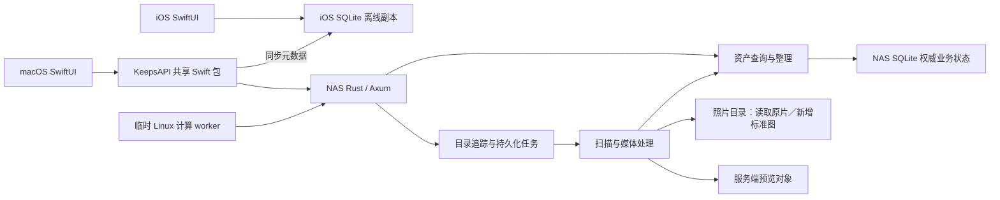

# Keeps 架构

产品导航与能力边界见 [统一服务端资料库](UX_DESIGN.md)。统一采用 HTTP/HTTPS API；macOS 支持显式文件夹导入，逻辑相册尚未实现。

## 唯一运行模式

Keeps 采用一个 NAS 核心服务和两个原生客户端。NAS 是照片索引、整理结果、任务状态和预览对象的权威真源；iOS 使用自己的 SQLite 图库副本直接驱动浏览，网络同步只更新副本。macOS 保持在线查询与内存列表缓存。

客户端使用共享 HTTP API。`chuan_nas` 的正式图库已从 Docker 迁至原生 SPK，原片路径保持不变，数据库与预览使用独立状态副本；旧 Docker 停止并保留。当前使用局域网入口，部署见[原生套件说明](../deploy/spk/README.md)。



## 代码入口与职责

| 目录 | 职责 |
| --- | --- |
| `server/` | 唯一活跃后端：Rust HTTP API、权威查询模型、SQLite、任务和媒体处理。 |
| `shared/` | `KeepsAPI` Swift 包：HTTP 请求、DTO、连接偏好、Keychain 凭据及 iOS SQLite 副本；无事件回放或照片处理。 |
| `macos/` | 统一资料库浏览、选择、筛选、整理表单及服务器来源/任务界面；`LibraryStore` 仅保存 UI 内存状态。 |
| `ios/` | 原生图库、详情与整理交互；`IOSLibraryStore` 从本地 SQLite 查询，`KeepsClient` 在后台同步 NAS。 |
| `deploy/nas/` | Docker 构建、历史部署与回退参考。 |
| `deploy/spk/` | 当前原生套件打包、启动与配置。 |
| `control_plane/` | 旧 Python 协议、迁移 seed 工具与对照测试；不是第二套活跃后端。 |
| `scripts/` | 客户端打包入口和显式执行的迁移工具。 |

Rust 主要模块：

- `main.rs`：配置、状态装配、监听与停机。
- `api.rs`：HTTP 认证和路由。
- `catalog.rs`：资产查询及数据库事务内的直接修改。
- `jobs.rs`：目录追踪、持久化扫描任务与文件处理记录。
- `media.rs`：原片元数据读取、精确 JPEG 图像指纹与预览生成。
- `versions.rs`：照片版本证据、候选查询及稳定默认版本。
- `revisions.rs`：持久化资料库／目录修订树、SQL 变更捕获和事务内祖先传播。
- `watcher.rs`：文件系统监听、目录变化入队和监听补漏。
- `store.rs`：数据库连接、业务表初始化和迁移；运行时不维护 ledger 或多源事件协议。
- `previews.rs`：服务端预览对象及签名 URL。

服务端扫描、媒体处理等后台任务的启动、轮询和恢复属于 NAS 进程。客户端关闭、离线或更换设备不得决定任务生命周期。

## 客户端边界

macOS 使用标准 Settings scene（⌘,）配置 Keeps Server 的服务地址、资料库和访问令牌；先验证服务鉴权与资产查询，成功后才持久化并切换连接。设置的“来源”页管理服务器目录追踪和手动扫描；独立的“任务追踪”原生窗口每 5 秒读取 `/libraries/{library}/task-status`，仅显示当前自动更新的照片、已知待更新照片数，以及一个后台长任务状态；不逐目录列出任务。数量按照片去重并扣除断点前已完成部分，未发现的文件不虚构总数。关闭使用系统窗口按钮；滚动条采用自动隐藏的浮动样式。设置不管理 NAS 设备、SMB 挂载或 SSH 登录。

macOS 查询、两端修改及 iOS 修订号检查经过 `shared/Sources/KeepsAPI/KeepsClient.swift`；iOS 离线包任务、下载与导入由共享包的 `KeepsOfflineRebuild` 执行。iOS 浏览查询经过 `KeepsLibraryDatabase`，在 Application Support/Keeps/Catalogs 保存本地 SQLite，服务器、图库及凭据摘要决定文件身份。客户端不生成、上传或回放 ledger，不进行本地照片文件扫描、不解析 EXIF，也不从本地原片生成预览。macOS 仅在用户显式导入时递归枚举所选文件夹、计算传输校验哈希并上传文件。

长任务必须显示进度条：有可靠总量时显示真实完成量，无总量时使用线性不定进度并显示当前阶段。移动同时显示用时；导入保留文件及字节进度，后台更新、扫描和目录回收不虚构百分比。

macOS 来源目录树支持在应用内把单个文件夹拖到目标文件夹中。客户端通过 `POST /libraries/{library}/directories/move-tasks` 提交 `path`、`parentPath` 与 `requestID`，由 NAS 持久任务完成移动及索引路径更新；通过 `GET /libraries/{library}/directories/move-tasks/{requestID}` 查询等待、校验、移动、索引和追踪阶段。macOS 保存任务 ID，断线或重启后继续查询同一任务，成功后重载目录并跟随新的选中路径。右键菜单支持重命名文件夹：同一任务接口追加 `name` 并保持原 `parentPath`，沿用进度、断线恢复和索引同步；名称必须是非空单个路径分量，来源根目录禁止重命名。已有同步 `/directories/move` 接口保留供已发布客户端使用。来源根目录不可拖动，不能移入自身、后代或原父目录；NAS 使用不覆盖目标的同文件系统 rename，拒绝同名覆盖和跨文件系统移动；持久移动记录用于服务重启时恢复索引同步。Finder 不参与此操作，日常照片目录整理优先在应用内进行。

macOS 照片菜单提供“删除所有弃用照片…”。NAS 预览并持久保存全库弃用照片清单，用户输入照片总数后提交同一任务 ID；服务端确认清单与文件身份未变后，逐文件调用 DSM 原生回收并保存进度、对账索引。重启不重放结果不确定的原生调用，客户端断网或重启继续查询同一任务；NAS 回收与图库软件回收站分开，恢复使用 File Station。接口及边界见 [服务端说明](../server/README.md#显式回收所有弃用照片)。

macOS 图库支持 Command/Ctrl+A 全选当前筛选结果（自动补齐分页）、Command 点选、Shift 连选、Shift 配合键盘左右方向键扩选与 Esc 取消选择；目录树保留 AppKit 的多选语义，Ctrl+A 选择已展开的可见目录。全选尚在加载时禁止移动或批量修改，切换查询会取消全选。照片可从全部照片、筛选结果或当前目录拖入目录树的目标文件夹，经 `POST /libraries/{library}/assets/move-tasks` 提交 `requestID`、`assetIDs`、`sourcePath`、`parentPath`，通过同路径 `/{requestID}` 查询持久任务。`sourcePath` 省略时按明确照片 ID 解析当前库已追踪范围内的来源，有值时限定来源目录。NAS 只移动所选范围内照片的有效文件、关联版本和 sidecar，其它目录的副本保留；批量移动先检查所有重名和跨文件系统冲突，逐文件使用不覆盖 rename 与恢复日志，同步照片索引及追踪归属。客户端持久保存任务并在重启后恢复查询，展示阶段、用时与完整失败信息。

客户端不存在“NAS / 本地”双资料库模式。默认浏览统一资料库；服务器来源目录属于按需展开的辅助视图和服务端管理配置。主图库查询不依赖目录导航成功。客户端无需 SMB 挂载，不能把服务器路径作为本机文件 URL 打开；预览和业务交互均走 HTTP。

用户选择的本地照片文件仅作为显式上传来源，客户端不监听或扫描原片资料库。iOS 本地 SQLite 是 NAS 的只读浏览副本，不是独立业务真源。业务请求使用 HTTP JSON，离线快照包和图片通过 HTTP 下载；当前共用手写 KeepsAPI，尚未引入 OpenAPI 客户端生成器。
客户端允许保留：

- 当前筛选、选择、已加载分页及表单状态；macOS 按查询保存列表内存缓存。
- iOS 持久化完整已同步图库副本：照片、文件路径关系、搜索/筛选字段、隐藏规则、目录导航、预览描述符和同步修订号。
- 服务地址与资料库名称等 UserDefaults 偏好。
- Keychain 中的访问凭据；旧 `ios.sync.*` 偏好继续读取，明文凭据成功迁移后移除。
- 网络图片缓存。缓存不是业务真源，丢失后可重新请求 NAS。

界面上的“修改评分”“保存标签”“移入回收站”直接提交资产 API，并使用服务器返回结果。请求失败显示错误，不切换到本地写入模式，也不排队产生离线业务事件。

macOS 使用 `KeepsAssetCache` 保存已加载列表与游标，最多 20 个查询、10,000 个资产，按最近使用淘汰，切换连接清空；退出应用后重新请求。返回已访问范围先显示缓存再校验目录修订号，全库查询校验库版本。前台每 5 秒核对范围，持续修改中的自动列表重载最多每 30 秒一次，最终版本变化及时刷新。目录导航独立保留 5 分钟更新及显式刷新，全库计数独立使用 60 秒窗口。

iOS 使用独立读取 actor 查询本地 SQLite，分页、搜索、精选、回收站和目录筛选不访问 NAS。启动先呈现界面；已有完整本地数据库时立即显示全库布局并允许滚动。首次只准备数据库与时间索引，进度显示在图库内容区域；缺少缩略图使用静态占位图，下载不阻塞交互。启动准备、回到前台及显式更新可以触发同步；图库与目录均不提供自定义上拉刷新。离线修改未实现，整理操作仍由 NAS 确认后更新本地行。

iOS 同步先读取全库 `/revision`。未要求强制重建、没有未完成旧同步检查点且本地修订号相同时，跳过重建；否则通过 `KeepsOfflineRebuild` 请求 NAS 一致性离线包。首次启动明确请求仅含数据库和目录的包，强制重建可包含缩略图；日常版本变化只下载数据库和目录包，再补缺失缩略图；不逐页拉取资产或逐层请求目录。下载支持持久断点，校验与导入失败保留旧库，完整协议见下文“iOS 照片浏览实现”。同步结束后重新读取本地全库轻量时间索引，UI 等待手势与减速结束再更新布局并恢复可见照片位置。网格滚动不依赖分页；全屏查看器的详细资产窗口最多保留 1,000 条，以时间与 ID 双向 keyset 分页，每页 200 条。点击任意远处照片时直接按 ID 读取详情并建立其附近窗口。所有副本替换和本地行清理只操作 SQLite，不触碰照片文件。

目录导航（包含空目录）随离线包持久化，由 `IOSDirectoryStore` 从本地数据库读取；普通展开不发网络请求，副本更新后重读已展示目录。切换服务器、图库或凭据打开独立数据库，取消旧请求并阻止旧结果发布。API 请求绕过 URLCache；缩略图和标准照片使用独立媒体缓存。

图片分为小缩略图、标准照片和可选 RAW。网格使用 `thumbnail`（迁移期间可显示旧 `preview`），查看器先小图再加载 `standard`。标准照片直接复用同资产已确认的 JPEG/HEIF，仅缺少已确认标准图的 RAW 由 NAS 生成完整分辨率 HEIF，保留指定拍摄元数据；生成的标准照片放在 RAW 所在的 `/volume2/photo` 对应目录，文件名使用 RAW 同名主干和 `.heic` 扩展名，重名时递增 `.1.heic`、`.2.heic`，不在名称中加入哈希；元数据 `Software` 和 `XMP CreatorTool` 标记为 `Keeps`，登记为同一资产的文件版本，不属于可删除缓存。仅创建新文件，不覆盖已有照片；3FR 暂缓标准图生成，仍生成小图。视频封面先缩到目标尺寸，再从前 60 帧选取代表帧，并以 PNG 中间帧进入 HEIC 编码；旧版视频封面单独重建，照片缓存不受影响。客户端在视频封面上显示播放标志。视频 `standard` 为 null，不把整段视频交给图片解码器。

两端共享 `PreviewCache`，目录为系统 Caches/KeepsMediaV2 下的 browse、thumbnail、standard、preview。小图不设固定总容量上限，可全库保存；标准照片与过渡旧预览分别为 5 GiB LRU，超限回收至 4 GiB。空闲空间低于 1 GiB 时回收当前用途的缓存；小图预取要求超过 2 GiB 空闲空间。升级只清理一次旧专用 KeepsPreviews，标记持久化；系统仍可回收 Caches，因此不承诺永久离线保存。缓存命中按确定的文件名直接读取，首屏不等待全目录扫描；无限容量的小图在空间充足时写入也不建全库索引，仅有限容量或低空间淘汰时建立 LRU 索引。内存成本按解码后的 bytesPerRow × height 计算，四个用途合计 iOS 72 MiB、macOS 288 MiB，按显示尺寸和屏幕倍率下采样。

缓存身份由服务器 URL、资料库、资产 UUID、用途和内容版本组成，不含签名 URL；相同用途身份的并发下载合并，不额外使用 URLCache。链接有效期 15 分钟；仅对 `preview_token_expired` 自动按用途刷新并重试一次，缓存登记实际返回版本。macOS 前台 `ThumbnailPrefetch` 以持久分页游标预取小图，覆盖隐藏与回收站资产，为交互下载让路，退出前台暂停后可继续。

iOS 的缩略图检查与补齐使用 `ThumbnailPrefetch.runLocal` 遍历本地 SQLite，覆盖隐藏及回收站记录；已缓存文件复用，缺图和失败分别记录。首次数据库导入后立即开放图库，再由后台预取逐项补齐两级小图。常规更新先刷新本地数据库，再补齐缺失小图并更新 iCloud 副本。首次准备使用 `BGContinuedProcessingTask`，常规更新使用短期后台时间及 `BGProcessingTask`；后台任务与 App 内共享阶段进度，取消和连接切换会终止旧任务。后台时机及缓存回收由系统决定，不承诺锁屏后立即完成或永久离线保留，具体准备与恢复流程见下文。

NAS schema 6 增加照片、视频、目录实体表；旧 catalog 保留公共资产查询、版本和整理状态，实体表随其同步，空目录在扫描时入库。`media_cache` 保存源版本、生成规格、pending/processing/ready/failed/cancelled 状态、有限重试和实际对象；现有单 worker 按照片组完成索引、身份、标准图和缩略图；缺失媒体也进入同一照片更新队列。NAS 每次调度处理一组照片，并发 1；临时 Linux worker 有独立的并发与资源上限，共享同一任务状态，不能重复领取 processing 项。缩略图最长边 512px，`KEEPS_THUMBNAIL_QUALITY` 默认 50，纳入规格版本；源变化、丢失、标准文件时间戳变化会重新排队。审计有独立时间字段，不伪造最近成功进度。完整尺寸标准照片编码 watchdog 为 900 秒，缩略图/旧预览仍为 180 秒；内存和线程限制相同。

本地生成失败、远端报错和租约过期时，先按任务源版本核对当前索引：资产已移入回收站或已无有效索引来源则标记 cancelled，退出待办及失败计数；源版本已变化则重新排入当前版本并重置重试次数；仍有效的任务保留完整错误及有限重试。迟到的旧版本失败不得覆盖新任务。来源重新入库后 cancelled 任务可恢复。现有空闲维护每轮只复核一条到期的历史失败记录，不重新编码、不扫描缓存目录、不删除缓存或原片；可读性、权限、磁盘与编码错误不能仅凭失败本身判定任务失效。

schema 8 增加 `remote_cache_tasks`，保存 Linux worker 的领取凭证、输入版本、1800 秒租约及完成状态。Linux 通过鉴权 HTTP 主动领取、下载、续租和上传；NAS 校验后沿用标准图独占发布与缓存登记。完成凭证和缓存 ready 在同一事务提交；断线可重试完成，租约过期回收且最多尝试 4 次。Linux 不直接访问数据库、不挂载照片目录、不对外监听。

schema 9 增加照片根身份映射。优先读取内嵌 XMP `xmpMM:OriginalDocumentID`，其次同目录 XMP；合法非空 UUID 直接信任，不要求内容哈希证明。缺少时沿用已有资产 UUID，新资产生成 UUID，并补写 metadata。ExifTool 支持写入的格式直接内嵌；3FR 等不支持格式写入 `原文件名.扩展名.xmp`，不改变 RAW 数据。同根 ID 的不同内容保留为版本/位置，移动后更新路径并保留资产 ID。生成标准图在 NAS 发布前继承根 ID。数据库仍是评分、标签、路径及任务的真源。

schema 10 增加 `catalog_deprecated_files` 和照片关联索引，迁移时在已有目录内重新核对照片关系；仅更新数据库关联和冗余文件说明，不删除或移动磁盘原片。版本 API 返回保留路径及判定依据。当前服务支持 schema 11；版本更旧的服务拒绝打开该数据库，部署前必须核对 schema 并备份双库。

schema 11 增加独立浏览图描述、来源缩略图版本与有限重试状态，不使现有 512px 缓存失效。NAS worker 优先处理手动作业、单文件自动变更及缺失普通预览，然后连续补齐浏览图，再执行目录扫描、补漏与常规维护；每张图之间重新检查高优先级任务，最多重试四次；来源变化重新排队，API 和离线包只发布匹配当前来源的版本。部署前停服备份并显式 migrate。

历史文件身份回填属于低优先级维护，每次最多一组照片，维护检查间隔至少 60 秒；自动更新与手动作业优先，正在远端处理的资产跳过。仅 metadata 写入造成的字节哈希变化在现有数据库事务中更新文件、版本、默认图、已完成远端任务及缓存描述，保留缩略图。`cache-status.identityBackfill` 提供 pending/ready/failed/missing 和错误；missing 代表历史路径已不存在，不删除任何照片。合法 ID 已存在时不重写。

临时 worker 在数据库事务中从现有状态索引直接领取一个到期 pending 项（LIMIT 1），不做全库优先排序，也不另设内存任务队列。缺标准的 RAW 仍在同一个任务中先生成完整标准图再生成小图，尚未拆为两个独立阶段。默认 4 并发、8 CPU、12GiB RAM、32GiB 临时预算。日常默认 NAS 本地编码开启（KEEPS_LOCAL_CACHE_ENCODING_ENABLED=1），远端派发关闭（KEEPS_REMOTE_WORKER_ENABLED 未设或为 0）。Linux 只在用户明确安排的一次性大规模处理时启用；服务器开关设为 1 后才能领取任务，Compose 需要显式 bulk profile，且不自动重启。批量处理结束恢复远端开关为 0 并停止 worker。部署见 [Linux worker](../deploy/linux-worker/README.md)。

`KEEPS_CACHE_GC_ENABLED=1` 时，新图验证后在同一事务切换旧 preview 引用并将旧对象放入持久 `media_cache_gc`。等待 20 分钟，每轮最多回收 20 个无当前引用对象，删除前再次核对 derivative_objects 与 media_cache。仅允许专用缓存根内的新 preview/thumbnail/browse 路径及已确认的历史 `64位hex-1200.heic` 格式；原片和标准照片不进入回收队列。尚有引用或生成失败时保留旧文件。状态由 `GET /libraries/{libraryID}/cache-status` 提供；retry/rebuild 每次选择最多 20 张照片，建立独立的一次性手动作业；实际重建在该照片获得执行机会后开始，不抢占当前照片。

交互 API 使用独立的长期 URLSession，与共享会话中的图片下载分离，避免目录请求和预览争用同一会话的连接调度。目录展开只返回当前层；服务端为每个目录探测是否存在可见直接子目录，遇到第一个即停止，`hasChildren` 返回真实布尔值，叶子目录不显示展开箭头。

macOS 目录树使用 `NSViewRepresentable` 包装原生 `NSOutlineView`，由 AppKit 负责树形行复用、展开折叠及键盘导航；SwiftUI 保留其它界面。目录节点按路径保持稳定身份，数据和展开状态由 `LibraryStore` 管理，Coordinator 仅桥接视图。数据源同步读取内存缓存，异步响应仅更新变化节点；收起再展开不重复请求，刷新保留有效展开、选择和滚动位置，切换服务器才重置。`local.keeps` 的 `navigation` 日志记录目录请求耗时与返回数量，不记录路径或凭据。

路径统一以 NAS 真实绝对路径为身份，例如 `/volume2/photo/照片`。原生套件直接访问照片目录，Docker 历史部署以宿主同路径挂入容器；导航、查询、追踪配置、扫描状态和 catalog_paths 使用同一路径，不再使用 `/originals/library` 别名或 Mac `/Volumes` 路径。唯一照片根为 `/volume2/photo`，`myphoto` 不参与追踪或挂载。历史目录关联可通过 `scripts/migrate_nas_paths.py` 离线恢复，核对文件存在/大小及既有资产记录；恢复不代表重新校验内容哈希。

导航条目包含数据库 `photoCount`，按 `(library_id,path)` 索引范围查询后代路径并对未回收资产去重；不枚举文件系统统计照片、不逐项请求图库分页。目录行在子目录或所选目录内容读取期间显示原生旋转指示，完成后恢复文件夹图标。计数独立于图库筛选条件。

## macOS 文件夹导入

Mac 顶栏“导入”（⌘⇧I）选择本机来源文件夹和已有的 NAS 追踪目录。来源可含子目录；RAW、JPG/JPEG、HEIF/HEIC/HIF 及同目录关联 XMP 默认全部平铺到一个目标目录，不按日期建目录。“保持导入结构”默认关闭；开启后在目标目录保留来源内部的相对子目录层级，不额外套一层来源目录。客户端只读来源，仅开启去重时按块计算 SHA256；排除隐藏项、符号链接、`@eaDir`、`#recycle` 和无关联 XMP。App Sandbox 使用用户所选文件的只读权限。

`POST /libraries/{library}/imports` 接受 `{id,targetPath,preserveStructure,deduplicate,files:[{id,relativePath,size,sha256}]}`，服务器按来源目录与文件主干为 RAW/JPEG/HEIF/XMP 分配不会覆盖已有文件的名称。`PUT .../imports/{batch}/files/{file}` 从请求流写入隐藏暂存并验证字节数和哈希；`POST .../imports/{batch}/finish` 在所有文件上传完成后以无覆盖方式发布 XMP 和照片，并返回 `{job}`，接入现有扫描、身份登记、版本判断及媒体处理。导入后按同目录、同主干及完整拍摄元数据规则归组 RAW 与 HEIF。

批次及上传状态保存在 NAS jobs 数据库；同一 manifest ID 重试返回当前状态，已上传文件跳过。Mac 展示文件/字节进度、失败文件和错误，可在当前应用会话继续批次，关闭导入面板后重开仍保留进度；退出应用后不自动恢复本地来源授权和批次。上传期间应用须运行，提交后的整理任务由 NAS 独立执行。完成提示区分“上传提交成功”与后台整理完成。单批次最多 10,000 个文件，每个文件 1 B–8 GiB。

目录删除确认后，macOS 暂停主窗口、快捷键、设置与任务窗口的其他操作，显示后台阶段和经过时间。客户端持久化任务 ID 和目标连接，超时继续查询，重启恢复同一任务；服务器已接受但记录丢失时提示人工核对，不重新删除。任务成功后刷新目录与图库。

## API 契约

业务路由需要共享访问凭据。首期使用单一 NAS 的 Bearer 认证，不声称具备多用户或租户隔离能力。服务仅接受配置的 `KEEPS_LIBRARY_ID`（默认 `local-library`）；鉴权后拒绝未知图库，返回 HTTP 404 / `library_not_found`，包括空库查询和目录写入。图库 ID 不是 NAS 用户名；合法但尚无照片的图库仍返回成功的空列表。预览下载使用服务端签名 URL。

| API | 用途 |
| --- | --- |
| `GET /libraries/{libraryID}/assets` | 分页查询、目录范围、搜索、评分、旗标、颜色、标签、回收站及排序。 |
| `GET /libraries/{libraryID}/assets/{assetID}` | 资产详情。 |
| `GET .../assets/{assetID}/versions` | 文件版本、路径、可用性和默认版本。 |
| `GET .../assets/{assetID}/version-candidates` | 非空拍摄时间、相机、镜头匹配的候选；不是自动合并结果。 |
| `PUT .../assets/{assetID}/default-version` | 指定已有可用版本，body 为 contentHash；入队重建默认预览。 |
| `GET /libraries/{libraryID}/revision?path=...&includeChildren=true` | 省略参数返回资料库单调修订号和 isUpdating；path 指定目录作用域，includeChildren 按需返回直接子作用域的版本与修改状态。仅查索引，不扫描照片或文件系统。 |
| `PATCH /libraries/{libraryID}/assets/{assetID}` | 修改评分、旗标、颜色和标签。 |
| `POST .../assets/{assetID}/trash` / `restore` | 修改共享回收站状态。 |
| `POST .../directories/trash` | 提交包含 UUID requestID 与完全相同目录名的持久异步任务，202 返回任务；GET 同路径加 /{requestID} 查询 waiting/recycling/reconciling/completed/failed 阶段，重试幂等。后台调用 DSM 原生 `synorecycle --rmdir`，由 NAS 自动管理回收位置和删除记录；不使用手工移动或永久删除兜底。详见服务端 README。 |
| `GET` / `PUT /libraries/{libraryID}/hidden-directories` | 读取和修改目录隐藏标记（path、hidden），返回 paths；仅改 NAS 数据库。 |
| `GET /libraries/{libraryID}/counts` | 全部、精选和回收站计数。 |
| `GET /libraries/{libraryID}/directories` | 服务器索引中的目录及数量。 |
| `GET /libraries/{libraryID}/navigation?path=...` | 服务器真实目录导航；省略路径返回追踪范围内的根入口，指定路径返回直接子目录，包含空目录；仅返回 `path`、`directories`，不再返回位置分区或本地暂存状态。 |
| `GET` / `POST /libraries/{libraryID}/folders` | 查看追踪目录与原片根路径、添加相对目录。 |
| `DELETE /libraries/{libraryID}/folders/{folderID}` | 停止追踪，保留原片。 |
| `POST .../folders/{folderID}/scan` | 提交扫描任务。 |
| `GET /libraries/{libraryID}/jobs` | 任务状态和错误。 |
| `POST .../jobs/{jobID}/retry` | 重试失败任务。 |
| `GET /derivatives/{assetID}?role=thumbnail&libraryID=...` | 按用途刷新签名下载 URL（role 三选一）。 |

分页响应为 `items`、`total`、`nextCursor`、`revision`、`isUpdating`；修订号、修改状态与照片数据来自同一个 SQLite 读事务，有 directory 时为目录子树版本，否则为资料库版本。游标由服务端解释。`capture_desc` 使用 `sort_time DESC, id ASC` 的 keyset 边界，不依赖边界照片仍存在；新增或删除边界之前的照片不改变后续页的位置。新返回游标为 `cd1.` 编码值；为已发布客户端和持久缩略图预取断点接收旧非负数字游标，下一页即升级为 keyset。其他排序仍使用数字偏移。`PATCH` 中省略字段表示不修改，显式 `colorLabel: null` 表示清除颜色。

旧 `/ops`、心跳、归档回执和客户端预览上传路由保持关闭。业务命令直接在 SQLite 事务中修改状态并更新修订号，不再生成 ledger、设备序号、逻辑时钟或归档回执。旧事件仅保留在迁移前数据库备份中。

## 数据与照片安全

- `KEEPS_ROOT=/keeps` 保存数据库、任务数据和可重建预览；宿主机路径 `/volume2/docker/keeps/data`。
- Compose 只挂载系统数据和 `/volume2/photo` 两个目录，服务端 `ORIGINAL_ROOT=/volume2/photo`。
- `/volume2/photo` 需要写权限用于创建标准照片；任何已有照片、RAW、sidecar 文件都不得删除、移动或以另一张照片覆盖；允许补写身份 metadata，但不得改变像素或 RAW 成像数据。标准图写入须防止重名覆盖。
- 停止目录追踪和图库回收站只改变服务器记录。用户显式输入同名确认的“删除文件夹”是上述文件移动限制的唯一例外：由 DSM 原生回收程序处理整个目录，不永久删除，不自行移动到 `#recycle`。
- 预览写入 `KEEPS_ROOT/previews`。维护生成的预览和缓存不能触碰原片。
- SQLite 是唯一业务真源；数据库 WAL 保留用于事务安全，它不是业务 ledger。schema 7 从已有业务表迁移，禁止通过重放旧事件恢复已移除的目录。数据库备份保存评分、标签和关联；文件备份保存照片内容。历史 Python 工具不属于生产运行时。

历史扫描/ledger 客户端的本地数据库不是新架构中的活跃数据源；新的 iOS SQLite 仅由 NAS API 同步建立。源码移除不删除用户已有数据库或照片；需要导入历史资料时，使用显式迁移工具和验证步骤，不能在新客户端启动时恢复旧扫描、复制或同步任务。

## HTTPS 外网入口

目标入口为同一 Keeps HTTPS 域名，经家庭路由器 TCP 443 转发到 NAS 专用 8443 上的 DSM 反向代理，再转发 NAS 本机 127.0.0.1:2283。仓库 Compose 仅将应用端口绑定到回环地址；域名、证书、路由规则及维护窗口确认后才可应用到现有服务。`CONTROL_PLANE_PUBLIC_BASE_URL` 必须与客户端 HTTPS 入口一致，使签名预览链接也可在外网访问。Keeps Bearer 鉴权不由 DSM 登录取代，原片仍仅由服务只读访问。

这项部署配置不代表外网已上线，实际验收见 [NAS 部署说明](../deploy/nas/README.md)。

## 客户端发布

客户端通过 TestFlight 内部测试分发，团队为 ClimaMind LLC（`3TZ6RCL8NE`）。`scripts/testflight.sh` 统一执行两端 Xcode 归档与 App Store Connect 上传；macOS 发布工程为 `macos/Keeps.xcodeproj`，继续复用现有 Swift 源文件与 KeepsAPI，本地 SwiftPM 测试与开发打包保持可用。iOS 使用既有工程，企业导出配置已移除。

macOS 发布构建启用 App Sandbox，只授权出站网络访问，不请求读取用户照片目录。连接凭据继续使用应用私有 Keychain；签名沙盒版本的配置读取与连接需实际安装验收。上传、Apple 处理、分配内部测试组和设备可安装是不同阶段，不能以归档成功代替发布完成。

## 验证边界

- `swift test --package-path shared`：共享 HTTP 路由、编码、分页、错误与服务器返回数据契约。
- `swift test --package-path macos`：客户端 UI 状态、远端交互和品牌资源。
- iOS Simulator 构建：共享包集成和原生客户端编译。
- `cargo test --manifest-path server/Cargo.toml`：服务端协议、存储、查询与任务测试。
- 真机/NAS 验收需要另外验证服务重启、原片只读挂载、任务持续执行、数据迁移及客户端到 NAS 的完整流程；编译或单元测试通过不能替代这些证据。

## Architecture Inventory

```json
{
  "repo_type": "photo_asset_manager_monorepo",
  "active_backend": "rust_nas_server",
  "client_role": "ux_only",
  "business_source_of_truth": "nas",
  "client_business_database": false,
  "client_event_replay": false,
  "client_original_processing": false,
  "client_nas_mount_required": false,
  "transport": "http_json",
  "key_directories": {
    "rust_server": "server",
    "shared_client_api": "shared",
    "macos_app": "macos",
    "ios_app": "ios",
    "legacy_migration_reference": "control_plane",
    "nas_deploy": "deploy/nas"
  },
  "entrypoints": [
    "server/src/main.rs",
    "server/src/bin/keeps-inspect.rs",
    "scripts/merge_tracked_folders.py",
    "server/src/api.rs",
    "shared/Package.swift",
    "shared/Sources/KeepsAPI/KeepsClient.swift",
    "shared/Sources/KeepsAPI/KeepsSettings.swift",
    "macos/Package.swift",
    "macos/Sources/PhotoAssetManager/PhotoAssetManagerApp.swift",
    "ios/KeepsIOS.xcodeproj/project.pbxproj",
    "ios/Sources/KeepsIOS/KeepsIOSApp.swift",
    "deploy/nas/docker-compose.yml"
  ],
  "server_modules": [
    "server/src/catalog.rs",
    "server/src/jobs.rs",
    "server/src/media.rs",
    "server/src/versions.rs",
    "server/src/revisions.rs",
    "server/src/watcher.rs",
    "server/src/store.rs",
    "server/src/protocol.rs",
    "server/src/previews.rs"
  ],
  "original_file_policy": "read_only_no_delete_move_or_overwrite",
  "nas_production_acceptance": "requires_live_verification"
}
```

## 隐藏目录

Catalog schema 2 新增按资料库隔离的隐藏目录标记。升级 schema 1 时需停服备份并显式执行 migrate；保留资产与历史事件。assets 与 counts 默认过滤隐藏内容，showHidden=true 关闭过滤；过滤先于分页和 total 计算。选中隐藏根或其后代时解除该根的过滤，独立隐藏的更深层后代仍需进入后查看。资产有多个路径时，只要包含仍被过滤的隐藏路径就不显示。导航入口仍保留。Mac 提供目录右键标记与菜单开关，开关为本机显示偏好，标记保存在 NAS。该功能属于浏览过滤，不是文件加密或访问控制。

### 持续集成

GitHub Actions 在 main push、PR 和手动触发时验证 Rust 服务、Apple 客户端、Python 控制平面与迁移工具，执行发布脚本测试和密钥扫描。CI 不持有发布凭据，不自动上传。发布脚本从本机 `codex-secret run app-store-connect` 接收认证环境变量，支持只读构建状态查询；归档和上传使用权限 0600 的临时私钥文件并在退出时清理。


## 照片版本与持续索引（schema 3）

一个资产可以关联多个文件内容版本，每个版本有多个物理路径；目录查询仍按资产去重。同一直接父目录内，内容哈希相同或具有精确 JPEG 图像指纹的新文件可归入同一资产；匹配证据本身须有该目录路径，不能借历史跨目录资产桥接。已有路径关联保留。JPEG 指纹跳过 EXIF/XMP/IPTC/注释，保留图像编码、方向、颜色空间、ICC 和 Adobe 颜色转换；缩略图哈希不能充当精确图像证据。拍摄时间保留亚秒与显式时区，原始时间文本和机身序列号随版本保存。没有时区时沿用服务时区，歧义时间报错。

同一直接父目录内，拍摄时间、相机品牌/型号、镜头全部非空且相同，并且文件主干相同的照片自动归为同一资产的不同版本，包括 RAW 与 HEIF、不同分辨率成片。文件内容 SHA-256 或精确 JPEG 图像指纹相同则只保留一个有效文件，其余写入 catalog_deprecated_files，记录保留路径、判定依据和中文弃用理由；仅标记，不删除、移动或改写原文件。弃用文件不作为有效版本展示或编码来源，详情中单独列出；保留文件消失后重新选择仍存在的副本。元数据一致但主干不同仍只列为候选。schema 10 迁移使用既有索引协调历史关系，保留原片路径、整理信息和身份别名，优先保留成片资产的已有缓存。升级仍须停服、备份双库并显式 migrate。

默认优先级为用户指定、明确内嵌 XMP HasSettings 的非 RAW 成片、其他可渲染格式、RAW。同级选择后保持稳定；候选排序按像素数和哈希决定首次选择，但已经选择的同级版本不会随扫描顺序切换。默认文件全部缺失时改选仍可用版本。没有任何可用原片路径的资产从普通列表和计数排除，按 ID 的历史记录保留；原片恢复并重新扫描后重新可见。更换默认立即使旧预览引用失效，后台从选定原片生成预览；提交预览时再次检查默认内容哈希，拒绝过时任务覆盖。客户端详情可查看版本并指定默认；所选版本须至少有一个仍在追踪的可用位置，否则返回 409 且不修改默认。macOS/iOS 前台每 5 秒检查资料库修订号，变化才刷新，后台暂停，切换连接取消旧请求。

schema 3 显式迁移只创建版本/默认/修订表，不合并、拆分或回填历史资产；已有路径和内容哈希的资产关联保留。历史资产没有版本证据时继续使用原预览。生产升级前停服并备份 catalog 与 jobs 两个 SQLite 数据库，catalog 使用 migrate 显式升级；jobs 打开时添加队列字段并恢复中断任务。schema 3 机制的 NAS 部署证据见部署文档；历史库整理仍单独执行。

文件监听与媒体 worker 在同一服务进程的独立后台任务运行，SQLite 是持久化队列。默认文件不变：原片 size/mtime 与 XMP sidecar 状态签名未变化且既有索引有效时直接跳过，不重新哈希或提取元数据，内容通知本身不强制重读整个目录。任务区分 `file`（单文件）、`directory`（当前层）和 `recursive`（子树）；照片创建、修改、删除、重命名只提交对应文件，XMP 变化核对当前层配套照片，平铺导入完成只核对目标目录当前层，保留结构导入及目录新增/移动/删除处理对应子树。

队列持久化 `work_class`：`automatic` 为文件变化，`manual` 为显式核对、导入和重试，`reconcile` 为启动/监听补漏。手动和自动分别排队，按照片组交替获得执行机会；同类内部按 file、directory、recursive 排序。没有高优先级待办时执行有限维护，再执行最低优先级全库补漏。不同类别不合并，同类别内保留范围去重与运行时重跑标记。

照片组包含同目录同主干配套原片，以及数据库已确认的同目录版本；同主干只是共同核对的范围，是否归为同一资产仍由既有身份/版本证据决定。组内完成元数据、身份与版本确认，再准备标准图和缩略图，不响应调度抢占；正常停服等当前组结束。处理前在 jobs SQLite 原子记录组成员，成功后清除标记；强制中断重启时使组内增量文件状态失效并重新排入照片更新，从头核对整组。维护和目录补漏仅在组与组之间保存待遍历目录、当前目录、最后完成文件名及计数，随后让出执行权。媒体子进程仍有 watchdog，失败保留错误并有限重试，不删除原片。

监听先注册目录再枚举子目录，排除隐藏项、@eaDir、#recycle 和符号链接。正常运行不再定时遍历目录树；新增/移除目录只调整对应子树，追踪配置变化才重建相关监听。启动时等待监听建立与一次补漏入队，再启动 worker，避免旧任务被提前领取导致重复启动扫描。断点任务遇到停机期间可能漏事件时，在恢复原进度后保留一次完整属性核对。缺失缩略图按数据库 LIMIT 1 转为自动照片更新，沿用完整照片处理边界。远端领取只等待相关 automatic 文件/目录变化，不等待手动核对或全库补漏；一轮延期领取也有上限，不能循环空转。先完成照片组核对，再编码。

跨目录移动仅在内容哈希唯一对应一个既有资产、所有历史同内容路径已确定不存在且新文件真实存在时复用原资产 ID；先登记新路径与版本，再撤销旧路径引用，保留默认版本、用户整理状态和有效缩略图。仍存在的跨目录副本与歧义匹配不会合并。

不再提供周期全库扫描或 `KEEPS_SCAN_INTERVAL_SECONDS` 配置。启动、监听溢出/错误、新增目录监听及用户手动操作才触发相应补漏。近期仍在写入的文件仅对该文件延迟重试；哈希、元数据和预览生成继续检查源状态。删除事件只移除对应文件/目录范围的失效索引，不能递归检查浅目录的其他后代。原片不由扫描删除、移动或替换；允许既有身份 metadata 补写，图像像素与 RAW 数据保持不变。无法读取目录或注册监听时保留完整错误，不能靠已取消的周期扫描静默掩盖缺口。已有缓存的低量审计与有限身份补写沿用现有后台批次，不创建周期全库扫描任务。

验证入口新增 `python3 server/tests/mechanisms_smoke.py`（KEEPS_TEST_IMAGE 指定本地测试镜像），仅在临时目录中验证 Linux 文件事件、JPEG 版本归组、连拍候选、默认切换、外部重命名/删除、重启和只读原片边界。

## 资料库与目录修订树（schema 5）

复用 SQLite/rusqlite，不新增缓存框架。`catalog_version_revision` 现在保存资料库的持久单调序号，不再在每次读取时叠加 ledger 最大序号；`catalog_directory_revisions` 保存目录路径、直接父路径与子树修订号。评分、标签、回收站和默认版本等前台写事务有实际变更时，为每个受影响资料库分配一个序号，并把所有受影响目录及祖先更新为该序号；共同祖先去重，兄弟分支和其他资料库不变。没有变化的扫描、重复评分/标签/回收站状态、重复默认选择和相同预览声明不更新版本。扫描观察时间、随机 snapshot assetID，以及同内容别名的文件名/派生 fingerprint 沿用旧版本证据，避免同一照片多个路径交替扫描造成误失效；真实 EXIF 和 sidecar 元数据变化仍被记录。

批量索引采用持久化修改窗口。`catalog_revision_updates` 按资料库、目录作用域和任务 owner 记录最近实际变化时间；首次变化立即递增版本并设 `isUpdating=true`，后续变化只刷新活动时间。新受影响的分支仍独立递增，已经修改中的共同祖先保持版本。`catalog_revision_sequence` 单独分配递增序号，因此修改中的祖先版本可以暂时低于子分支。前台修改仍立即发布，并延长相关活动窗口。

显式扫描／协调任务完成后可立即发布最终版本；watcher 事件、启动补漏和中断任务进入最后一次实际变化后的 15 分钟静默窗口，期满再递增一次并清除状态。合并任务只要包含外部来源就保留静默要求；无变化的补漏核对不延长窗口。pending、running 和等待重试的任务不会因超时提前稳定；多个 owner 共享祖先时，最后一个 owner 释放后才能稳定。任务来源、活动时间和 owner 均落盘，启动时恢复；后台约每 5 秒维护一次状态，失败、取消和已消失任务转入静默收尾，不会永久占用。15 分钟是缓存收尾窗口，不是文件锁。

数据库 AFTER 触发器比较 OLD/NEW 列，只把有变化的资产、旧/新路径或隐藏配置记入 `catalog_revision_dirty`。现有服务器写事务在 commit 前统一 flush；失败时数据、脏标记和修订号一起回滚。路径删除保留旧分支的修订记录，避免客户端一直缓存消失的内容。隐藏规则会影响同资产的其他路径，因此隐藏/取消隐藏同时更新这些关联分支。预览的内容、位置、尺寸和删除也参与版本传播，纯审计事件序号/预览声明时间不参与。

默认 `/revision` 返回 `{ "revision": 123, "isUpdating": false }`；指定 path 则追加规范化的 `path`。`includeChildren=true` 追加 `children: [{ "path": "/photos/year", "revision": 123, "isUpdating": false }]`，默认不枚举子作用域；资料库根的直接子作用域为已索引的 `/`。path 必须是绝对规范路径，尾部斜线会去除；非法路径返回 422。尚未索引的合法目录返回版本 0。children 包含历史路径作用域，不保证该目录当前仍存在，不能替代真实目录导航。

客户端可先核对资料库版本，再按需核对已缓存的目录版本，版本变化或 isUpdating=true 时重新查询照片；isUpdating=true 的响应不能作为稳定缓存，即使 revision 相等。保存新列表时使用列表响应自身的 revision 和 isUpdating。筛选、排序、分页与 showHidden 等参数仍属于客户端缓存身份，不能只以版本号作为缓存 key。Mac 使用 KeepsAssetCache；iOS 使用完整图库 SQLite 副本与全库同步修订号，详情见上方客户端数据契约。

版本树只描述 catalog 已知状态。`navigation` 仍读取真实文件系统，包含未索引空目录；追踪配置和任务状态仍属于独立 jobs SQLite，不计入 catalog 版本。不能仅凭 catalog revision 对这些接口返回 304 或永久复用导航缓存。watcher 收到事件时可先标记修改中，照片数据仍由 worker 入库后传播，本次没有移除后台扫描，也没有把现有 photoCount 改为增量计数。

schema 3 升级到 4 需要沿用停服、备份、`keeps-server migrate` 流程。迁移一次性从现有路径建立目录祖先索引，把库序号设为旧协议值加一，以保持单调并让旧缓存失效；保留照片数据、版本证据与 ledger。schema 4 不可直接用旧服务器打开，回退必须恢复升级前数据库。停服离线维护脚本的直接 SQL 由持久触发器捕获，服务器启动时在监听 HTTP 前统一发布遗留变更；不支持运行期间绕过 Store 直接改库。schema 4 升级到 5 增加持久批次状态和序号分配表，保留当前修订号；同样需要停服、备份和显式迁移。合并工具接受 schema 3/4/5。

## 同目录批量整理

`scripts/merge_tracked_folders.py` 是显式离线维护入口，plan 用生产双库只读快照与实际只读挂载交集逐层检查，apply 要求服务停止、自动备份、核对计划未变化，并跨 catalog/jobs/维护审计数据库原子提交。只合并同直接父目录的精确内容重复；元数据相似、用户字段冲突、历史跨目录资产和未完整索引的目录单独报告。

媒体证据由 `server/src/bin/keeps-inspect.rs` 通过逐行 JSON 提供，复用服务端媒体读取器；不打开业务数据库、不生成预览。检查断点缓存、计划和合并映射位于 KEEPS_ROOT/maintenance。所有原片保留，旧 ledger 不改写；只回放历史 ledger 不能还原离线合并，恢复需双库备份和作业记录。具体规则、命令和回滚说明见 [批量整理](folder-merge.md)。

### iOS 照片浏览实现

iOS 主图库由 SwiftUI 包装 UIKit `UICollectionView`，使用自定义虚拟布局、cell reuse 与 `UICollectionViewDataSourcePrefetching`；不使用 PhotoKit，照片仍来自 NAS 与本地 SQLite。`KeepsLibraryDatabase.timeline` 查询完整筛选结果的 ID、日期、图片描述符、文件名与精选标记，不解码完整资产。`KeepsTimelineGeometry` 支持单张、3、5、9 列：方格位置直接计算，原比例布局预计算行高度并二分查找视口，只为附近照片创建布局属性。网格从开始就覆盖完整图库，滚动与日期定位不读取中间分页；完整索引随图库规模增长，详细资产、cell 与解码图片保持有界。滚动偏移不写回 SwiftUI，日期栏仅在可见日期改变时更新。

图库保持最新照片在底部、更早照片在顶部，右侧日期定位条可直接拖到全库任意位置。同步、筛选或布局变化以可见照片 UUID 和距视口的像素距离恢复位置，普通滚动不替换数据窗口。四档缩放与方形／原比例样式独立，支持捏合、点击、长按菜单和照片详情。快速滚动及附近预取只读取本地图片，离开视口取消尚未完成的读取/解码；缺图不沿途启动网络请求，停下后可见照片再走正常补图路径。网格先显示 64px 浏览小图，停下后按屏幕像素尺寸补清晰图，已有清晰图不降级。浏览小图由 NAS 从已有 512px thumbnail 生成最长边 64px、质量 50 的 HEIF，以 browse 用途全库缓存；客户端不再生成 JPEG。加载中、生成尚未完成和读取失败使用同一张共享静态占位图，不切换转圈或错误图标。图库及目录不提供自定义上拉刷新，底部仅保留悬浮栏固定空间；启动只以本地数据库可用性判断图库是否就绪，已有数据库可离线浏览占位网格。

iCloud 仅使用 Keeps 的私有容器 `iCloud.com.hechuan.Keeps`，不接入 PhotoKit。活动 SQLite 和浏览缩略图仍在本机；`KeepsCloudReplica` 把 SQLite backup API 生成的一致性单文件快照及按版本标识的缩略图交给 iCloud Documents 同步，使用 `NSMetadataQuery` 发现云端占位、`NSFileCoordinator` 协调读写。容器 namespace 按 NAS 地址与图库 ID 分隔，不含访问令牌；非敏感连接信息通过 iCloud key-value storage 恢复。仅空白本地数据库可导入云快照，缺失缩略图先从云恢复，再由 NAS 补齐；已有文件复用，不删除原片。相同或更旧的本地 revision 不覆盖现有云快照。系统上传完成状态不能由本地 stage 完成代替。

NAS 离线重建由 `POST /libraries/{library}/offline-rebuild` 创建任务，读取独立 SQLite 一致快照，在 NAS 本地生成客户端数据库、完整相册目录及已有有效缩略图，发布不可变 USTAR 文件。包内 `thumbnails/` 保存普通预览，`browse-thumbnails/` 保存快速浏览图，清单分别记录已有和缺失数量；iCloud 副本也保存两级图片。快照包含隐藏和回收站记录，以读取时点的 revision 标识，不依赖全库静止或 `isUpdating=false`。iOS 只查询任务进度并连续下载一个文件；失败后以 Range、ETag 和已落盘字节恢复，SHA256 与清单验证通过后导入本地库，失败保留旧库。不再由 iOS 逐页拉取照片或逐目录重建。首次启动请求数据库包以尽早显示布局，显式强制重建可包含缩略图；日常版本检查未变化时跳过，变化时请求只含数据库和目录的包，复用本地缩略图并补齐新增图片。数据库重建成功与全库缩略图齐备分别判断；NAS 尚无缩略图的记录保留缺图状态，不阻塞已正确建立的离线库。缩略图缺失不阻塞进入图库：可见照片自行加载，后台预取补齐全库两级缩略图。首次 iCloud 恢复也只等待数据库，不等待云端缩略图。数据库导入与图片完整性分开判断，图片失败不回退已导入数据库。准备过程提供暂停与继续。

前台开始的首次准备使用 `BGContinuedProcessingTask`，常规更新使用短期后台时间及 `BGProcessingTask` 调度，后台流程包括数据库、缺失缩略图和 iCloud 副本。取消会传递到数据库同步任务，前后台接管等待旧任务退出后再写库；中断后沿持久化包任务与已落盘字节继续；首次数据库包导入后即可滚动，图片由后台预取继续补齐。系统任务和 App 内显示同一阶段进度。系统决定后台运行时机；手动强制退出不保证继续执行应用代码。

`IOSPhotoViewer` 读取有界浏览窗口，并在两端触发本地分页；信息表单以 sheet 呈现，`IOSZoomablePhoto` 使用 UIKit `UIScrollView` 承载共享预览。多选仍使用逐资产 PATCH / trash / restore API，无新增服务端接口。macOS 保留现有等高行布局。iOS 部署目标为 26，浮动控件使用原生 Liquid Glass。

`IOSCollectionsView` 与 `IOSDirectoryBrowser` 从 `IOSDirectoryStore` 读取本地持久化目录导航。`IOSRootView` 把当前数据库与同步动作传给目录 store，数据库更新后重读已展示目录；首次无副本时等待同步，普通目录展开不访问网络。目录页与主图库使用同一个 galleryPage，目录路径进入本地 SQL 过滤。顶部标题与网格纵向排列，目录面板为网格 top overlay，不压缩照片视口；浮动控件位于各自导航页面。

顶部导航采用 `safeAreaInset` 与 `ultraThinMaterial`，网格使用系统 `backgroundExtensionEffect()` 向安全区域延伸背景；该效果不改变实际照片视口，也不把目录菜单纳入网格布局。API 依据：[Apple backgroundExtensionEffect](https://developer.apple.com/documentation/swiftui/view/backgroundextensioneffect())。

目录面板以 ScrollView 内容的实际高度决定尺寸，最大为照片视口高度；超出时滚动并留出底部浮动导航避让空间，保持全宽直角磨砂覆盖效果。`ios/Package.swift` 提供图库与目录状态模块的宿主测试，`swift test --package-path ios` 验证本地启动、离线查询、同步跳过、失败保留和连接隔离；SQLite 查询及持久性在共享包测试。

### 本地 AI 调色验证工具

`macos/ColorTools` 是独立原生 Swift helper（已接入 macOS 设置验证和图库单张/多张调色），固定调用 darktable 5.6.2 CLI。模型经 stdio MCP 读取预览/区域裁切，设置绝对参数、比较不可变候选并选择结果；配方适配层负责 XMP 模块版本、顺序和局部蒙版。原片只读复制到任务私有目录，候选按操作 ID 幂等落盘；每次从固定 baseline 重建，不累积改写原片。RAW 验证支持曝光、源白平衡 RGB 倍率、sigmoid、饱和度及渐变/椭圆局部曝光；JPEG/HEIF 保留原生色彩管线，当前支持曝光与饱和度，工具按输入返回可用参数；几何蒙版仅支持方向为 1 的底片；人物/背景/天空语义软蒙版通过 darktable 原生 rasterfile 接入，支持 EXIF 1–8 方向，物化时还原传感器方向。人物与背景调用 Apple Vision，天空使用固定校验和的 MIT SkySegSmall Core ML 模型。AI 先查看遮罩再引用 maskID；完整 PNG 内嵌配方支持异目录重放，模型上下文及历史摘要不重复传输像素。每张蒙版最多 512 KiB/2048px，配方最多 8 张蒙版和 12 MiB，工作台同步总量最多 64 MiB；过大明确报错并保留本机草稿。天空分割可能误判建筑/云纹理，不能把返回蒙版当作质量保证。NAS 只保存客户端上传的结果与配方，不执行调色。

专用 Skill 位于该包 `Skills/keeps-color`。`scripts/evaluate_ai.py` 仅供开发验证，显式指定 Codex、helper、darktable、输入和全新任务目录，默认 GPT-6 Luna；禁用通用 shell、插件及外部应用工具，只加载本地调色 MCP，保留事件与结构化结果，并核实模型所选候选确实已渲染。此脚本必须显式提供专属 `--codex-home` 和 `--account-email`，拒绝默认开发者目录及不匹配的账户，不继承环境中的 API 凭证。渲染测试通过 `KEEPS_TEST_DARKTABLE` 和 `KEEPS_TEST_RAW` 指定本机输入，未配置则跳过真实 RAW 集成测试。

macOS「设置 → AI 修图」提供运行环境检查、指定邮箱登录、退出、连接测试与内置公开 JPEG 样片验证。原生 Swift runner 只调用应用 `Contents/Helpers` 内的 Codex、helper、darktable；Skill 位于 `Contents/Resources/AIEditing`，不搜索系统安装，不回退到开发账户。认证与日志位于 Application Support/Keeps/AIEditing；Codex 使用其中的独立 `codex` 目录、file 凭证和强制 ChatGPT 登录，每次请求核对实际邮箱。首次 OAuth 授权由用户在浏览器完成，登录状态可在应用重启后重新读取。设置中的公开样片测试仅生成本地候选。图库信息按钮下方和信息面板底部提供 AI 调色入口，进入工作台前冻结选中照片，选中照片后进入即开始调色。客户端有限并发处理，照片任务、AI 会话、本地渲染、下载、上传上限均可在设置中调整（1–20，默认 20/20/2/2/2），每批启动时固定上限，调色工作台原地替换图库；横竖图按接近的预览面积展示，原图与候选保持相同尺寸，极端比例受窗口宽度与预览高度限制。取消和完成位于底部，存在运行、同步或待处理后台决定时禁止返回图库；取消保留草稿，全部逐张决定处理成功后完成并返回图库。每张使用独立 Codex 进程与任务目录；darktable 与展示图生成共用文件锁渲染名额，进程退出自动释放。任务阶段、耗时与逐张 requestID 持久化，网络故障等待重连、重启继续、已提交请求幂等确认；单张失败不阻塞其它照片，AI 暂时失败触发会话退避。失败暂停时允许重新登录，取消保留已提交结果。每次 AI 运行实时记录脱敏 JSONL 及本地每日用量账本，以运行 ID 和事件行号去重并恢复未完成记录；失败用量计入，缺失用量标为未知。美元金额采用记录时的模型费率快照，明确为 Standard 短上下文 API 等价估算，不代表登录账户账单。工作台先使用图库缓存展示调整前照片，本地预览后台解码。每张调色结束独立进入待确认，展示调整前和候选预览、对应意见；可以选回调整前、切换候选或追加单张要求。继续调色从同一底片实际应用所选完整配方，不在输出图上累积调整。只有用户明确确认，客户端才生成 standard/thumbnail/browse 三图，经 revision 校验原子提交后更新图库；原片不变。发布与弃用使用独立调度名额，不等待其余照片调完；用户采用或弃用后该照片立即从工作台移除，后台进度仅显示在底部状态栏；成功静默刷新图库，失败才恢复到工作台并提供逐张重试。弃用只设置 rejected 标记，不删除文件。选择调整前只保存确认意见和幂等历史，不改变媒体。每版意见、用户要求、偏好快照与最终配方 metadata 一起保存。

NAS schema 13 增加资料库级 AI 审美偏好与工作台 JSON 草稿，分别使用 revision 乐观并发，不改变图库媒体修订。通过 `/libraries/{library}/ai-editing/preferences` 和 `/workspace` 读写；`assets/{asset}/edit/decisions` 保存保留调整前版本的决定。长期偏好默认只读，双击打开编辑界面并显式保存；批次启动时固定偏好版本与本批要求，单张对话不会自动改变长期偏好。Mac 保存可恢复执行状态和候选渲染缓存，NAS 保存草稿、确认及意见；本版继续执行需回到创建工作台的 Mac。窗口关闭不丢失草稿，暂停后可继续；未确认的旧上传任务迁移为待确认。网络或版本冲突保留本机草稿，可保留副本后重新载入 NAS 草稿。schema 12 升级需停服、备份并显式执行 migrate；客户端和 NAS 须配套升级。其他设备和离线包只读取已发布编辑展示图。

Release 归档要求显式 `KEEPS_CODEX_BINARY` 与 `KEEPS_DARKTABLE_APP`，固定公开 Codex 0.161.0 和 darktable 5.6.2；缺少组件或签名身份即失败。当前 AI 发行包仅支持 Apple Silicon。构建记录版本/摘要并从内到外签名，子进程继承主应用沙盒；保留上游许可及对应源指向，绝不复制登录凭证。没有运行时输入的普通 Debug/CI 包显示组件缺失。

运行验证使用安装包内置的公开 CC0 风景 JPEG（Nick West，Landscape），许可与来源随图打包。设置流程只读取该资源，不访问用户照片库，不依赖 NAS 或样片下载缓存。资料库版本下载接口保留为受鉴权的通用只读 API，校验资产归属、追踪路径与文件状态。
