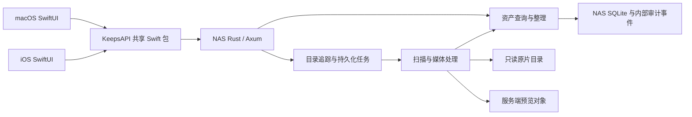

# Keeps 架构

产品导航与能力边界见 [统一服务端资料库](UX_DESIGN.md)。统一采用 HTTP/HTTPS API；本地上传与逻辑相册尚未实现。

## 唯一运行模式

Keeps 采用一个 NAS 核心服务和两个原生薄客户端。NAS 是照片索引、整理结果、任务状态和预览对象的唯一真源；macOS 与 iOS 只负责用户交互、HTTP 请求及可丢弃的图片缓存。

客户端已切换到共享 HTTP API；Rust 服务已在 `chuan_nas` 部署并完成历史数据迁移，首次全库扫描仍在后台运行。本文描述职责和代码边界，实际部署步骤与验证结果以 [NAS 部署说明](../deploy/nas/README.md) 为准。



## 代码入口与职责

| 目录 | 职责 |
| --- | --- |
| `server/` | 唯一活跃后端：Rust HTTP API、权威查询模型、SQLite、任务和媒体处理。 |
| `shared/` | `KeepsAPI` Swift 包：HTTP 请求、DTO、连接偏好及 Keychain 凭据；无 SQL、事件回放或照片处理。 |
| `macos/` | 统一资料库浏览、选择、筛选、整理表单及服务器来源/任务界面；`LibraryStore` 仅保存 UI 内存状态。 |
| `ios/` | 原生图库、详情与整理交互；`IOSLibraryStore` 通过同一个 `KeepsClient` 查询 NAS。 |
| `deploy/nas/` | Docker Compose、环境配置及 NAS 部署说明。 |
| `control_plane/` | 旧 Python 协议、迁移 seed 工具与对照测试；不是第二套活跃后端。 |
| `scripts/` | 客户端打包入口和显式执行的迁移工具。 |

Rust 主要模块：

- `main.rs`：配置、状态装配、监听与停机。
- `api.rs`：HTTP 认证和路由。
- `catalog.rs`：资产查询、修改及与服务器内部审计事件的衔接。
- `jobs.rs`：目录追踪、持久化扫描任务与文件处理记录。
- `media.rs`：原片元数据读取、精确 JPEG 图像指纹与预览生成。
- `versions.rs`：版本证据、候选查询、稳定默认版本及资料库修订号。
- `watcher.rs`：文件系统监听、目录变化入队和监听补漏。
- `store.rs` / `protocol.rs`：历史事件存储、协议验证、幂等和审计兼容。
- `previews.rs`：服务端预览对象及签名 URL。

后台任务的启动、轮询和恢复属于 NAS 进程。客户端关闭、离线或更换设备不得决定任务生命周期。

## 客户端边界

macOS 使用标准 Settings scene（⌘,）配置 Keeps Server 的服务地址、资料库和访问令牌；先验证服务鉴权与资产查询，成功后才持久化并切换连接。设置不管理 NAS 设备、SMB 挂载或 SSH 登录。

两端的查询与修改经过 `shared/Sources/KeepsAPI/KeepsClient.swift`。客户端不创建业务 SQLite，不生成、上传或回放 ledger，不扫描目录、不解析 EXIF，也不从本地原片生成预览。

客户端不存在“NAS / 本地”双资料库模式。默认浏览统一资料库；服务器来源目录属于按需展开的辅助视图和服务端管理配置。主图库查询不依赖目录导航成功。客户端无需 SMB 挂载，不能把服务器路径作为本机文件 URL 打开；预览和业务交互均走 HTTP。

未来本地文件仅作为显式上传来源。上传尚未实现，不恢复客户端监听、扫描或本地业务数据库。协议选择保持 HTTP JSON，当前共用手写 KeepsAPI；尚未引入 OpenAPI 客户端生成器。
客户端允许保留：

- 当前筛选、选择、已加载分页及表单状态。
- 服务地址与资料库名称等 UserDefaults 偏好。
- Keychain 中的访问凭据；旧 `ios.sync.*` 偏好继续读取，明文凭据成功迁移后移除。
- 网络图片缓存。缓存不是业务真源，丢失后可重新请求 NAS。

界面上的“修改评分”“保存标签”“移入回收站”直接提交资产 API，并使用服务器返回结果。请求失败显示错误，不切换到本地写入模式，也不排队产生离线业务事件。

预览由 KeepsAPI 中的共享图片加载器加载，两端使用同一缓存策略。iOS/iPadOS 与 macOS 每个应用各有 5 GiB 磁盘缓存，位于系统 Caches/KeepsPreviews；按文件字节统计，超限时按最近访问时间淘汰到 4 GiB，启动读取和新增缓存时检查容量。写入前检查可用空间；不足 1 GiB 时回收磁盘图片缓存。若写入仍因磁盘满而失败，记录错误并显示已下载图片，其他写入错误正常上报。无固定 TTL，系统清除或文件损坏后重新下载；缓存写入与清理只访问该专用目录。

磁盘身份由服务器 URL、资料库、资产 UUID 和预览版本组成，不包含签名下载 URL；刷新链接不会重复缓存同一版本。内存使用 NSCache，iOS 64 MiB、macOS 256 MiB 的成本目标，按解码图片 bytesPerRow × height 计费，淘汰由系统控制；按显示尺寸和屏幕倍率下采样，内存身份另含解码尺寸。同一磁盘身份的并发下载合并；使用无 URLCache 的图片会话，避免签名链接产生另一份 HTTP 磁盘缓存。

签名下载 URL 有效期为 15 分钟。服务端对验签成功但过期的下载令牌返回 HTTP 403、detail.code=preview_token_expired；客户端仅对这个明确错误自动刷新并重试一次，其他错误显示完整详情并允许手动重试。刷新响应包含预览版本，缓存必须写入实际返回版本，不能把新图片记为旧版本。NAS 当前有效预览对象长期保留，不参与客户端 LRU。没有预览时显示占位，客户端不回退读取 NAS 路径或本地原片。

交互 API 使用独立的长期 URLSession，与共享会话中的图片下载分离，避免目录请求和预览争用同一会话的连接调度。目录展开只返回当前层；服务端为每个目录探测是否存在可见直接子目录，遇到第一个即停止，`hasChildren` 返回真实布尔值，叶子目录不显示展开箭头。

macOS 目录树使用 `NSViewRepresentable` 包装原生 `NSOutlineView`，由 AppKit 负责树形行复用、展开折叠及键盘导航；SwiftUI 保留其它界面。目录节点按路径保持稳定身份，数据和展开状态由 `LibraryStore` 管理，Coordinator 仅桥接视图。数据源同步读取内存缓存，异步响应仅更新变化节点；收起再展开不重复请求，刷新保留有效展开、选择和滚动位置，切换服务器才重置。`local.keeps` 的 `navigation` 日志记录目录请求耗时与返回数量，不记录路径或凭据。

路径统一以 NAS 真实绝对路径为身份，例如 `/volume2/photo/照片`。原片以宿主同路径只读挂入容器；导航、查询、追踪配置、扫描状态和 catalog_paths 使用同一路径，不再使用 `/originals/library` 别名或 Mac `/Volumes` 路径。根 `/volume2` 下按真实层级显示 `photo`、`myphoto`。历史目录关联可通过 `scripts/migrate_nas_paths.py` 离线恢复，核对文件存在/大小及既有资产记录；恢复不代表重新校验内容哈希。

导航条目包含数据库 `photoCount`，按 `(library_id,path)` 索引范围查询后代路径并对未回收资产去重；不枚举文件系统统计照片、不逐项请求图库分页。目录行在子目录或所选目录内容读取期间显示原生旋转指示，完成后恢复文件夹图标。计数独立于图库筛选条件。

## API 契约

业务路由需要共享访问凭据。首期使用单一 NAS 的 Bearer 认证，不声称具备多用户或租户隔离能力。服务仅接受配置的 `KEEPS_LIBRARY_ID`（默认 `local-library`）；鉴权后拒绝未知图库，返回 HTTP 404 / `library_not_found`，包括空库查询和目录写入。图库 ID 不是 NAS 用户名；合法但尚无照片的图库仍返回成功的空列表。预览下载使用服务端签名 URL。

| API | 用途 |
| --- | --- |
| `GET /libraries/{libraryID}/assets` | 分页查询、目录范围、搜索、评分、旗标、颜色、标签、回收站及排序。 |
| `GET /libraries/{libraryID}/assets/{assetID}` | 资产详情。 |
| `GET .../assets/{assetID}/versions` | 文件版本、路径、可用性和默认版本。 |
| `GET .../assets/{assetID}/version-candidates` | 非空拍摄时间、相机、镜头匹配的候选；不是自动合并结果。 |
| `PUT .../assets/{assetID}/default-version` | 指定已有可用版本，body 为 contentHash；入队重建默认预览。 |
| `GET /libraries/{libraryID}/revision` | 资料库单调修订号，供客户端按需刷新。 |
| `PATCH /libraries/{libraryID}/assets/{assetID}` | 修改评分、旗标、颜色和标签。 |
| `POST .../assets/{assetID}/trash` / `restore` | 修改共享回收站状态。 |
| `GET` / `PUT /libraries/{libraryID}/hidden-directories` | 读取和修改目录隐藏标记（path、hidden），返回 paths；仅改 NAS 数据库。 |
| `GET /libraries/{libraryID}/counts` | 全部、精选和回收站计数。 |
| `GET /libraries/{libraryID}/directories` | 服务器索引中的目录及数量。 |
| `GET /libraries/{libraryID}/navigation?path=...` | 服务器真实目录导航；省略路径返回追踪范围内的根入口，指定路径返回直接子目录，包含空目录；仅返回 `path`、`directories`，不再返回位置分区或本地暂存状态。 |
| `GET` / `POST /libraries/{libraryID}/folders` | 查看追踪目录与原片根路径、添加相对目录。 |
| `DELETE /libraries/{libraryID}/folders/{folderID}` | 停止追踪，保留原片。 |
| `POST .../folders/{folderID}/scan` | 提交扫描任务。 |
| `GET /libraries/{libraryID}/jobs` | 任务状态和错误。 |
| `POST .../jobs/{jobID}/retry` | 重试失败任务。 |
| `GET /derivatives/{assetID}?role=preview&libraryID=...` | 刷新预览下载 URL。 |

分页响应为 `items`、`total`、`nextCursor`；游标由服务端解释。`PATCH` 中省略字段表示不修改，显式 `colorLabel: null` 表示清除颜色。

旧 `/ops`、心跳、归档回执和客户端预览上传路由已关闭；事件格式仅用于 NAS 内部审计与历史数据迁移。客户端直接提交业务命令，不接触事件协议。

## 数据与照片安全

- `KEEPS_ROOT` 保存服务数据库、任务数据、预览及其他服务工件；当前宿主机路径 `/volume2/myphoto/keeps`。
- Compose 将四个既有原片目录按 NAS 绝对路径只读挂载，服务端 `ORIGINAL_ROOT=/volume2`；容器仅暴露这些原片目录，服务数据另挂 `/myphoto/keeps`。
- Compose 将原片目录以只读方式挂载。任何照片、RAW、sidecar 原始文件都不得删除、移动或覆盖。
- 停止目录追踪和移入回收站只改变服务器记录，不能对应磁盘删除。
- 预览写入 `KEEPS_ROOT/previews`。维护生成的预览和缓存不能触碰原片。
- SQLite 与 ledger 只属于 NAS 内部。历史 Python 数据库与事件用于迁移、兼容和审计；同一状态目录不能同时运行新旧后端。

旧客户端的本地数据库不是新架构中的活跃数据源。源码移除不删除用户已有数据库或照片；需要导入历史资料时，使用显式迁移工具和验证步骤，不能在新客户端启动时恢复旧扫描、复制或同步任务。

## 客户端发布

客户端通过 TestFlight 内部测试分发，团队为 ClimaMind LLC（`3TZ6RCL8NE`）。`scripts/testflight.sh` 统一执行两端 Xcode 归档与 App Store Connect 上传；macOS 发布工程为 `macos/Keeps.xcodeproj`，继续复用现有 Swift 源文件与 KeepsAPI，本地 SwiftPM 测试与开发打包保持可用。iOS 使用既有工程，企业导出配置已移除。

macOS 发布构建启用 App Sandbox，只授权出站网络访问，不请求读取用户照片目录。连接凭据继续使用应用私有 Keychain；签名沙盒版本的配置读取与连接需实际安装验收。上传、Apple 处理、分配内部测试组和设备可安装是不同阶段，不能以归档成功代替发布完成。

## 验证边界

- `swift test --package-path shared`：共享 HTTP 路由、编码、分页、错误与服务器返回数据契约。
- `swift test --package-path macos`：客户端 UI 状态、远端交互和品牌资源。
- iOS Simulator 构建：共享包集成和原生客户端编译。
- `cargo test --manifest-path server/Cargo.toml`：服务端协议、存储、查询与任务测试。
- 真机/NAS 验收需要另外验证服务重启、原片只读挂载、任务持续执行、数据迁移及客户端到 NAS 的完整流程；编译或单元测试通过不能替代这些证据。

## Architecture Inventory

```json
{
  "repo_type": "photo_asset_manager_monorepo",
  "active_backend": "rust_nas_server",
  "client_role": "ux_only",
  "business_source_of_truth": "nas",
  "client_business_database": false,
  "client_event_replay": false,
  "client_original_processing": false,
  "client_nas_mount_required": false,
  "transport": "http_json",
  "key_directories": {
    "rust_server": "server",
    "shared_client_api": "shared",
    "macos_app": "macos",
    "ios_app": "ios",
    "legacy_migration_reference": "control_plane",
    "nas_deploy": "deploy/nas"
  },
  "entrypoints": [
    "server/src/main.rs",
    "server/src/bin/keeps-inspect.rs",
    "scripts/merge_tracked_folders.py",
    "server/src/api.rs",
    "shared/Package.swift",
    "shared/Sources/KeepsAPI/KeepsClient.swift",
    "shared/Sources/KeepsAPI/KeepsSettings.swift",
    "macos/Package.swift",
    "macos/Sources/PhotoAssetManager/PhotoAssetManagerApp.swift",
    "ios/KeepsIOS.xcodeproj/project.pbxproj",
    "ios/Sources/KeepsIOS/KeepsIOSApp.swift",
    "deploy/nas/docker-compose.yml"
  ],
  "server_modules": [
    "server/src/catalog.rs",
    "server/src/jobs.rs",
    "server/src/media.rs",
    "server/src/versions.rs",
    "server/src/watcher.rs",
    "server/src/store.rs",
    "server/src/protocol.rs",
    "server/src/previews.rs"
  ],
  "original_file_policy": "read_only_no_delete_move_or_overwrite",
  "nas_production_acceptance": "requires_live_verification"
}
```

## 隐藏目录

Catalog schema 2 新增按资料库隔离的隐藏目录标记。升级 schema 1 时需停服备份并显式执行 migrate；保留资产与历史事件。assets 与 counts 默认过滤隐藏内容，showHidden=true 关闭过滤；过滤先于分页和 total 计算。选中隐藏根或其后代时解除该根的过滤，独立隐藏的更深层后代仍需进入后查看。资产有多个路径时，只要包含仍被过滤的隐藏路径就不显示。导航入口仍保留。Mac 提供目录右键标记与菜单开关，开关为本机显示偏好，标记保存在 NAS。该功能属于浏览过滤，不是文件加密或访问控制。

### 持续集成

GitHub Actions 在 main push、PR 和手动触发时验证 Rust 服务、Apple 客户端、Python 控制平面与迁移工具，执行发布脚本测试和密钥扫描。CI 不持有发布凭据，不自动上传。发布脚本从本机 `codex-secret run app-store-connect` 接收认证环境变量，支持只读构建状态查询；归档和上传使用权限 0600 的临时私钥文件并在退出时清理。


## 照片版本与持续索引（schema 3）

一个资产可以关联多个文件内容版本，每个版本有多个物理路径；目录查询仍按资产去重。同一直接父目录内，内容哈希相同或具有精确 JPEG 图像指纹的新文件可归入同一资产；匹配证据本身须有该目录路径，不能借历史跨目录资产桥接。已有路径关联保留。JPEG 指纹跳过 EXIF/XMP/IPTC/注释，保留图像编码、方向、颜色空间、ICC 和 Adobe 颜色转换；缩略图哈希不能充当精确图像证据。拍摄时间保留亚秒与显式时区，原始时间文本和机身序列号随版本保存。没有时区时沿用服务时区，歧义时间报错。

拍摄时间、相机品牌/型号、镜头必须全部非空且相同才成为元数据候选；两份都有机身序列号且不一致则排除。文件名不再用于自动归组，缺失字段不等于匹配。RAW 与导出成片、裁剪调色等视觉相似匹配目前仅有元数据候选机制，尚未实现经真实样本校准的视觉匹配器；不能宣称已自动识别人眼意义上的全部版本，历史精确重复合并由显式离线维护脚本处理；视觉相似合并与拆分尚未实现。

默认优先级为用户指定、明确内嵌 XMP HasSettings 的非 RAW 成片、其他可渲染格式、RAW。同级选择后保持稳定；候选排序按像素数和哈希决定首次选择，但已经选择的同级版本不会随扫描顺序切换。默认文件全部缺失时改选仍可用版本。更换默认立即使旧预览引用失效，后台从选定原片生成预览；提交预览时再次检查默认内容哈希，拒绝过时任务覆盖。客户端详情可查看版本并指定默认；所选版本须至少有一个仍在追踪的可用位置，否则返回 409 且不修改默认。macOS/iOS 前台每 5 秒检查资料库修订号，变化才刷新，后台暂停，切换连接取消旧请求。

schema 3 显式迁移只创建版本/默认/修订表，不合并、拆分或回填历史资产；已有路径和内容哈希的资产关联保留。历史资产没有版本证据时继续使用原预览。生产升级前停服并备份 catalog 与 jobs 两个 SQLite 数据库，catalog 使用 migrate 显式升级；jobs 打开时添加队列字段并恢复中断任务。schema 3 机制的 NAS 部署证据见部署文档；历史库整理仍单独执行。

文件监听与媒体 worker 在同一服务进程的独立后台任务运行，SQLite 是持久化队列。监听逐层注册追踪目录，排除隐藏项、@eaDir、#recycle 和符号链接，配置变化与新增子目录自动更新监听。真实变化按受影响目录合并、防抖 2 秒入队，强制重读该范围元数据；普通周期核对同时比较原片和 XMP sidecar 的状态签名，跳过未变文件，补上停机期间仅 sidecar 改变的情况。任务运行中再次出现变化会保留下一轮，重启恢复 pending，处理失败最多自动重试三次并保留错误链。变化任务优先，全库普通扫描可在文件处理完成且运行超过 30 秒后让出给变化任务；单次媒体解码仍受已有超时约束。

定期扫描保留默认 300 秒；启动、监听溢出与新增监听也补扫，事件不是唯一真源。近期仍在写入的文件推迟处理，哈希/元数据/预览生成前后检查文件状态。外部删除仅在目录可正常读取后更新缺失路径，并为替代默认版本补预览；原片永远不由服务删除、移动或覆盖。目录不可正常读取时保留旧索引并报告错误；生产验收还需覆盖挂载异常。监听数量受 NAS inotify 限额约束，注册失败记录错误并由定期核对补漏。

验证入口新增 `python3 server/tests/mechanisms_smoke.py`（KEEPS_TEST_IMAGE 指定本地测试镜像），仅在临时目录中验证 Linux 文件事件、JPEG 版本归组、连拍候选、默认切换、外部重命名/删除、重启和只读原片边界。

## 同目录批量整理

`scripts/merge_tracked_folders.py` 是显式离线维护入口，plan 用生产双库只读快照与实际只读挂载交集逐层检查，apply 要求服务停止、自动备份、核对计划未变化，并跨 catalog/jobs/维护审计数据库原子提交。只合并同直接父目录的精确内容重复；元数据相似、用户字段冲突、历史跨目录资产和未完整索引的目录单独报告。

媒体证据由 `server/src/bin/keeps-inspect.rs` 通过逐行 JSON 提供，复用服务端媒体读取器；不打开业务数据库、不生成预览。检查断点缓存、计划和合并映射位于 KEEPS_ROOT/maintenance。所有原片保留，旧 ledger 不改写；只回放历史 ledger 不能还原离线合并，恢复需双库备份和作业记录。具体规则、命令和回滚说明见 [批量整理](folder-merge.md)。

### iOS 照片浏览实现

iOS 图库使用 KeepsAPI 的 `KeepsPhotoGrid` 计算大图、中图的等面积行及密集方格；Mac 保留等高行布局，iOS 仅复用其预览宽高比读取方法。图库档位持久化，通过捏合手势与菜单切换；行使用固定尺寸占位，仅可见时加载图片，分页每次 200 张以覆盖密集视图。`IOSPhotoViewer` 管理当前浏览快照和分页选择，信息表单以 sheet 呈现；`IOSZoomablePhoto` 使用 UIKit `UIScrollView` 承载共享预览，处理原生缩放与拖动。照片预览继续走 KeepsAPI 的签名 URL 与缓存。

图库时间轴维持服务端 `capture_desc` 分页，显示时反向遍历行与行内照片，使最新照片位于底部。更早分页加在视觉顶部；`IOSLibraryStore` 在刷新时重读已加载窗口，在浏览旧内容时延后自动刷新。多选使用现有逐资产 PATCH / trash / restore API，精选集通过目录导航和 `directory` 查询浏览照片，无新增服务端接口。iOS 部署目标为 26，主图库浮动控件使用原生 Liquid Glass。

### iOS 精选集目录导航（2026-09-28）

`IOSCollectionsView` 使用 `navigation` HTTP API 展示服务器和本地占位，不再提供全部照片、精选入口或调用相应计数。`IOSCollectionRoute` 保存原生导航路径；`IOSDirectoryStore` 单独管理当前层目录的加载、错误和请求代次，目录读取不依赖资产分页。`IOSLibraryStore.directory` 进入 `KeepsAssetQuery.directory` 和刷新身份，保持现有递归查询及过期响应隔离。文件夹目的页与主图库使用同一个 `galleryPage` 和相同网格边距，目的页隐藏原生导航栏，以当前文件夹名为标题，并提供返回按钮；点击文件夹图标使 `IOSDirectoryBrowser` 在标题下展开。顶部标题按钮与网格采用纵向布局，网格裁切于独立视口；子文件夹菜单使用网格的 top overlay，不参与尺寸计算，展开不会压缩网格。精选集照片页隐藏日期，主图库保留日期。底部浮层位于各自导航页面内。没有新增服务端接口、本地资料库或权限申请。

顶部导航采用 `safeAreaInset` 与 `ultraThinMaterial`，网格使用系统 `backgroundExtensionEffect()` 向安全区域延伸背景；该效果不改变实际照片视口，也不把目录菜单纳入网格布局。API 依据：[Apple backgroundExtensionEffect](https://developer.apple.com/documentation/swiftui/view/backgroundextensioneffect())。
